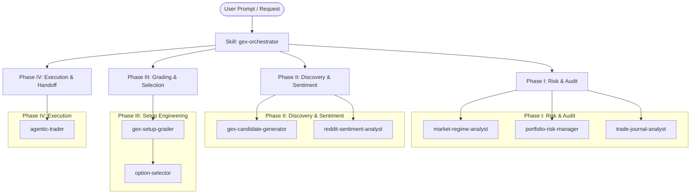

# GEX Options Trading System - Agent Workspace

Welcome to the **Gamma Exposure (GEX) Options Trading System** agent workspace. This project is a systematic, mechanical swing-trading platform for single-stock options engineered around dealer gamma positioning, volatility regimes, and liquidity dynamics.

---

## 1. System Architecture & Agent Integration

Agents and skills in this workspace operate under strict quantitative discipline and separation of concerns.

---

## 2. Core Execution Principles & Behavioral Directives

1. **Strict Tool-Mediated Human Interaction**:
   - For every question, clarification, choice, or confirmation directed to the human, use the `ask_question` tool.
   - Never request or infer confirmation through ordinary chat text.
   - Use fixed options with clear labels. A skipped, empty, or ambiguous response never authorizes a trade, broker write, gate skip, or override.

2. **Mandatory Account Preflight**:
   - Establish the target Robinhood account first via `robinhood-trading/get_accounts` and `robinhood-trading/get_portfolio`.
   - If target account(s) are explicitly listed in the agent prompt (e.g. `accounts: ••••9961`), validate and resolve them directly against retrieved live accounts.
   - If not specified in the prompt or if ambiguous, prompt the user using `ask_question` with masked account labels, account type, buying power, and `agentic_allowed` status.
   - All downstream CLI commands (e.g. `update-option`, `update-stock`, `portfolio`, `sync-positions`, `sync-pnl`) **MUST** explicitly pass `--account ACCOUNT_NUMBER`.
   - Never combine or aggregate accounts unless explicitly instructed by the user.

3. **Batch Chunking & Tool Guardrails**:
   - **Option Quotes**: Chunk contract lookups (`get_option_quotes`) into batches of **at most 40 contract IDs** per query to prevent HTTP 414 errors.
   - **Equity Fundamentals**: Chunk symbols in `get_equity_fundamentals` to batches of **at most 10 symbols** per request.
   - **Sequential Watchlist Queries**: Never query `get_watchlist_items` in parallel; run sequentially to avoid index scrambling.

4. **Exit Stop Priority Order (Stops 1 to 5)**:
   - **Stop 1 (Structural Stop)**: Close below $nTrans$ (Secondary Support). Exit at next session open.
   - **Stop 2 (Trailing Volatility Stop)**: Profit drawdown from peak (e.g. 20% giveback of max gain).
   - **Stop 3 (Time Stop / Theta Gate)**: Exit if DTE falls below 14 days or position stalls $>10$ trading days without progress.
   - **Stop 4 (Macro / Regime Stop)**: Bearish regime transition or Bull:Bear ratio collapse.
   - **Stop 5 (Catastrophic Risk Stop)**: Hard stop at -50% position value.

5. **No Manual Calculations**:
   - Always run the deterministic Python engine: `python3 src/gex_engine.py <subcommand>`.
   - Track workflow state using `python3 src/gex_engine.py workflow` and `update-workflow`.

6. **Dual Candidate Discovery, Watchlist Separation & Hygiene Pruning**:
   - **Dual Candidate Universe**: Candidate discovery must find and track both **stock underlier candidates** (`data/candidate_stocks.json`) and specific **option contract candidates** (`data/candidate_options.json`). Sourcing must prioritize options liquidity (scanners with 30d options volume $\ge 10,000$, IV $\ge 30\%$, relative options volume), inspect the dedicated Robinhood **"options watchlist"** via `robinhood-trading/get_option_watchlist`, and pre-screen viable contracts.
   - **Scanner Percentage Formatting**: Any Robinhood scanner filter with `unit_type: PERCENTAGE` (`FILTER_TYPE_IMPLIED_VOLATILITY`, `FILTER_TYPE_PERCENT_CHANGE_FROM_CLOSE`, etc.) **MUST** use decimal ratios. For example, $30\%$ IV must be passed as `["0.30"]` (passing `["30"]` evaluates as $3,000\%$ IV and returns 0 results), and $+0.30\%$ price change must be passed as `["0.003"]` (passing `["0.30"]` evaluates as $+30.00\%$).
   - **Rule 7 Earnings Distinction**: `"Upcoming Earnings GEX"` scans for underliers with earnings in 0–7 days. These candidates are strictly for post-earnings reaction tracking, NOT pre-earnings trade entry (which is prohibited under Rule 7's 14-day earnings blackout).
   - **Pending Stock Candidates**: Add screened and pending stock underliers to the equity watchlist (`GEX_DAILY_CANDIDATES`) via `robinhood-trading/add_to_watchlist` using `symbols`.
   - **Outdated Stock Entries Pruning**: Regularly prune outdated entries from `GEX_DAILY_CANDIDATES` via `python3 src/gex_engine.py prune-candidates` and `robinhood-trading/remove_from_watchlist`. Any ticker that becomes an active portfolio holding, is graded `REJECTED`, or falls out of the screened candidate universe must be removed after user confirmation.
   - **Option Contract Candidates**: Add screened and isolated option contract candidates separately to the dedicated Robinhood **"options watchlist"** via `robinhood-trading/add_option_to_watchlist` using `option_ids` (with `position_type: "long"`). Prune expired or non-viable options via `robinhood-trading/remove_option_from_watchlist`.
   - Never mix equity and options watchlist tools.

7. **Portfolio Sizing Threshold & Micro-Account Rules**:
   - **Threshold**: **\$10,000 Portfolio Net Liquidation Value**.
   - **Accounts $\ge \$10,000$ (Standard Accounts)**: Strictly enforce percentage sizing constraints: single-leg limit $\le 3.0\%$ to $5.0\%$ of Net Liq, and sector concentration cap $\le 15.0\%$.
   - **Accounts $< \$10,000$ (Micro-Accounts, e.g. `••••9961`)**: Percentage constraints and sector caps are marked **`EXEMPT`** in sizing checklists. Trades are sized for a **1-contract minimum allocation**, constrained strictly by available cash buying power (contract cost $\le$ Available Cash Buying Power; no margin leverage).

---

## 3. Skills Catalog in `.agents/skills/`

The workspace discovers and activates the following skills:

| Skill | Directory | Core Function |
| :--- | :--- | :--- |
| **gex-orchestrator** | [gex-orchestrator](.agents/skills/gex-orchestrator/SKILL.md) | End-to-end daily GEX run, account selection, Phase I-IV execution. |
| **market-regime-analyst** | [market-regime-analyst](.agents/skills/market-regime-analyst/SKILL.md) | Basket gate, 15-ETF Bull:Bear ratio, VIX delta compression. |
| **portfolio-risk-manager** | [portfolio-risk-manager](.agents/skills/portfolio-risk-manager/SKILL.md) | Live position sync, Stop 1-5 evaluation, buying power budgeting. |
| **gex-candidate-generator** | [gex-candidate-generator](.agents/skills/gex-candidate-generator/SKILL.md) | Sources stock & options candidates from scanners (options vol/IV), options watchlist, extracts contracts, and syncs candidates. |
| **gex-setup-grader** | [gex-setup-grader](.agents/skills/gex-setup-grader/SKILL.md) | Option chain parsing, pTrans/nTrans derivation, 11-Rule checklist. |
| **option-selector** | [option-selector](.agents/skills/option-selector/SKILL.md) | Isolates 30-45 DTE contracts, earnings preflight, spread checks. |
| **agentic-trader** | [agentic-trader](.agents/skills/agentic-trader/SKILL.md) | Pre-trade clearance, sizing, order simulation, execution confirmation. |
| **trade-journal-analyst** | [trade-journal-analyst](.agents/skills/trade-journal-analyst/SKILL.md) | Realized P&L reconciliation, rule adherence audit, recommendations. |
| **reddit-sentiment-analyst** | [reddit-sentiment-analyst](.agents/skills/reddit-sentiment-analyst/SKILL.md) | Social sentiment on WSB/options/stocks, FOMO / Capitulation alerts. |
| **futures-trading-analyst** | [futures-trading-analyst](.agents/skills/futures-trading-analyst/SKILL.md) | Multi-timeframe futures trend analysis (/ES, /NQ), pivot levels. |

---

## 4. MCP Servers Configuration

Configured in [.agents/mcp_config.json](.agents/mcp_config.json):
- `robinhood-trading`: `npx mcp-remote https://agent.robinhood.com/mcp/trading`
- `mcp-reddit`: `npx -y mcp-reddit`
