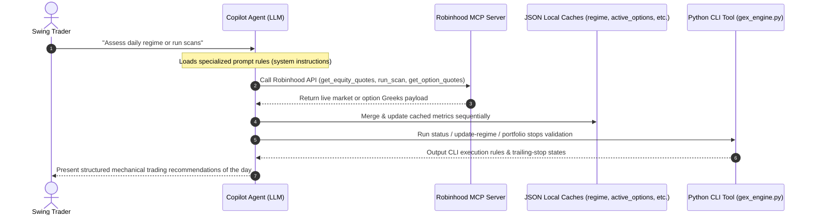
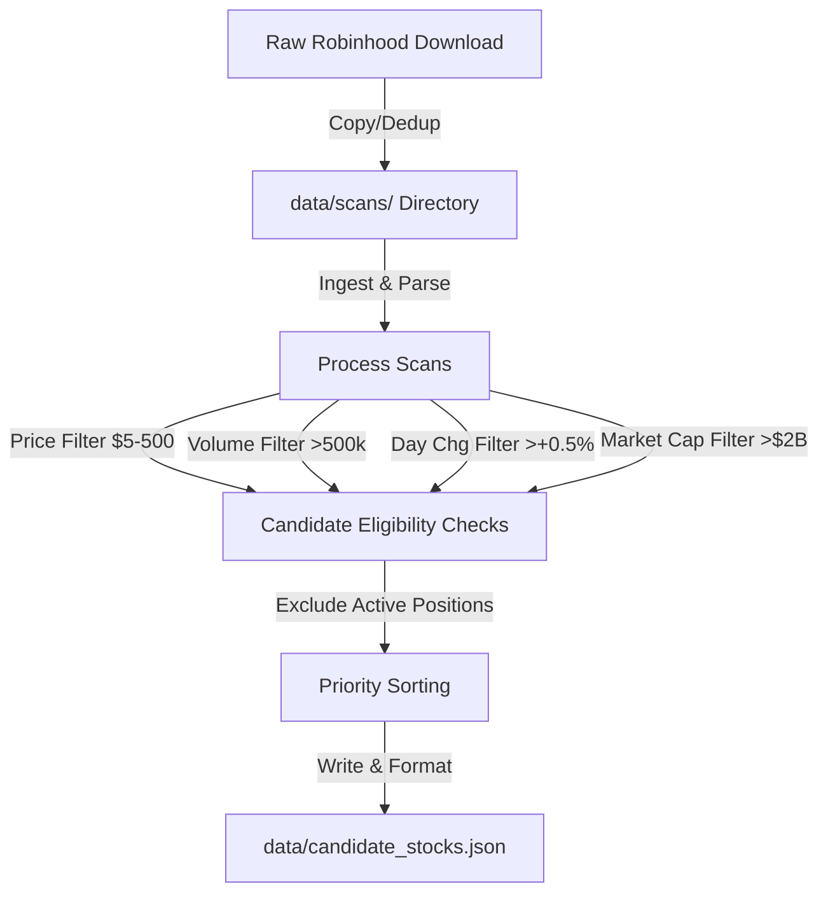
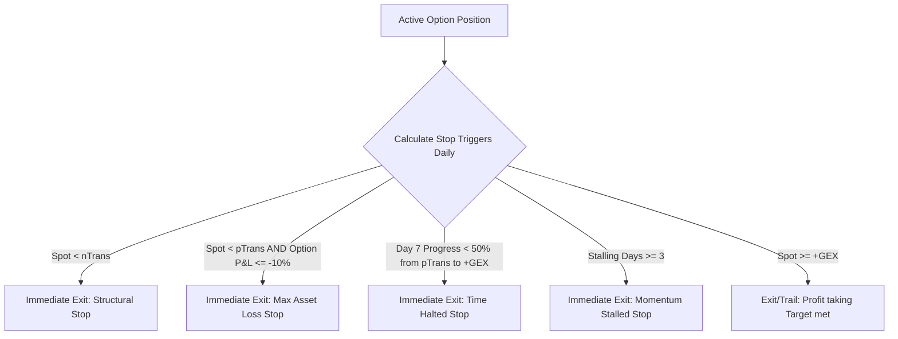

# 📊 GEX Options & Agentic Portfolio Trading Suite

Welcome to the GEX Options & Agentic Portfolio Trading Suite! This repository provides an automated, programmatic mechanical trading workflow that integrates dealer gamma positioning checks, rule-based portfolio risk-management, futures strategy analysis, and secure execution on Robinhood.

The system consists of a Python mechanical GEX engine CLI and specialized Copilot prompts designed to guide interactive swing-trading decisions.

---

## 🦾 Prompt-Driven Execution & The Robinhood MCP Server

This trading suite is designed to be executed via **Agentic Chat-Driven Automation** within VS Code, leveraging the **Robinhood MCP (Model Context Protocol) Server** as the primary data-pipeline and execution broker. 

The division of labor is split between the **AI Copilot Agent**, the list of **Local Specialized Prompts**, and the **Local CLI Engine**:



### 1. Model Context Protocol (MCP) Integration
The workspace utilizes an integrated Model Context Protocol (MCP) server bound to Robinhood. This server provides the LLM with direct, runtime capability to fetch real-time market data, pull portfolio allocations, and execute order routing.
- **Data Gathering**: The agent calls `mcp_robinhood-tra_get_equity_quotes`, `mcp_robinhood-tra_get_option_quotes`, and `mcp_robinhood-tra_get_option_positions` dynamically. The returned JSON structures are recorded locally and feed the engine's algorithms.
- **Automated Screening**: The agent calls `mcp_robinhood-tra_run_scan` or `mcp_robinhood-tra_get_scans` to identify volatility-compression or high-option-volume breakouts.
- **Transaction Routing**: When a setup is `CONFIRMED` and broad-market gates authorization is active (`ALL TRACKS OK`), the agent evaluates portfolio sizing parameters, verifies available buying power via `mcp_robinhood-tra_get_accounts`, reviews option price spreads, and routes limit orders securely.

### 2. Specialized LLM Prompts (Prompt-Driven Decisons)
Four targeted, machine-readable markdown prompt manifests (located in the [.github/prompts/](.github/prompts/) directory) govern the agent's behavior. These prompts provide System Instructions to enforce strict quantitative rules, eliminating emotional discretion:
- **[.github/prompts/gex-regime-trading.prompt.md](.github/prompts/gex-regime-trading.prompt.md)**: Coordinates the **Daily Broad-Market Regime Gates** calculations, parses the sector ETF pool, fallbacks to volatility indices or proxy tracking, and executes candidate setup grading. It mandates caching raw API responses in date-specific folders and sequential file updating to prevent parallel mismatch errors.
- **[.github/prompts/robinhood-portfolio-analysis.prompt.md](.github/prompts/robinhood-portfolio-analysis.prompt.md)**: Standardizes cash-reserve evaluations, risk weighting calculations, and portfolio concentration limits ($\le 3.0\%$ of Net Liquidation Value per option leg; $\le 15.0\%$ cumulative technology allocation).
- **[.github/prompts/robinhood-agentic-trading.prompt.md](.github/prompts/robinhood-agentic-trading.prompt.md)**: Manages secure buy/sell routing, price-spread buffers, buying power verification, and underlier tradability sweeps.
- **[.github/prompts/futures-trading-strategy.prompt.md](.github/prompts/futures-trading-strategy.prompt.md)**: Directs intraday futures trading, calculating multi-timeframe trends, Initial Balance (IB) ranges, VWAP deviations, and strict contract-sizing limits.

---

## 🛠️ Repository Components

This workspace is structured as follows:

1. **Python Mechanical GEX Engine**:
   - [src/gex_engine.py](src/gex_engine.py): The main execution script. It enforces dynamic options analyses, status updates, portfolio trailing/loss stops, and tracks risk allocations.
2. **Persistent Local Cache Databases**:
   - [data/regime.json](data/regime.json): Holds the computed status, gates, and metrics for the broad market Daily Regime Gates.
   - [data/ticker_analyses.json](data/ticker_analyses.json): Accumulates setup grading metrics (Spot, transition levels, Delta Balance change thresholds). See the [data/ticker_analyses.json](data/ticker_analyses.json) [Schema Documentation](#-dataticker_analysesjson-schema-documentation) below for the complete specification.
   - [data/active_options.json](data/active_options.json): Records open options positions, premium tracking, holding period, and stalling status. See the [data/active_options.json](data/active_options.json) [Schema Documentation](#-dataactive_optionsjson-schema-documentation) below for the complete specification.
3. **Specialized Copilot Prompt Manifests** (located in the [.github/prompts/](.github/prompts/) directory):
   - [.github/prompts/gex-regime-trading.prompt.md](.github/prompts/gex-regime-trading.prompt.md): Implements rules-based options swing trading using GEX/dealer positioning mechanics.
   - [.github/prompts/robinhood-portfolio-analysis.prompt.md](.github/prompts/robinhood-portfolio-analysis.prompt.md): Pulls and parses holdings, evaluates cash reserves, and designs customized allocation rebalancing recommendations.
   - [.github/prompts/robinhood-agentic-trading.prompt.md](.github/prompts/robinhood-agentic-trading.prompt.md): Orchestrates buying power validation, tradability sweeps, and handles limit-order routing.
   - [.github/prompts/futures-trading-strategy.prompt.md](.github/prompts/futures-trading-strategy.prompt.md): Analyzes multi-timeframe trends, Initial Balance ranges, VWAP deviations, and strict contract-sizing calculations.

---

## 🚀 Getting Started

### 1) Prerequisites
- Python 3.8 or higher.
- A functional terminal or shell environment.

### 2) Running the CLI Engine
The core execution script is [src/gex_engine.py](src/gex_engine.py). It operates via subcommands to parse different mechanical gates:

#### Check broad market authorization regime:
```bash
python3 src/gex_engine.py status
```

#### Recompute the Daily Regime Gates from raw market inputs:
```bash
python3 src/gex_engine.py update-regime --spy 0.62 --qqq 1.10 --bulls 120 --bears 35 --vix-bearish True --vix-spot 15.20
```
Gates are computed mechanically: **Basket** (SPY or QQQ > $+0.5\%$), **Bull:Bear** (ratio $> 3.0{:}1$), **VIX Delta** (dealer positioning bearish on VIX). Authorization resolves to `ALL TRACKS OK` (3/3), `TRACK 1 OK` (2/3), or `BLOCKED`.

#### Dynamically grade a quantitative GEX setup:
```bash
python3 src/gex_engine.py analyze AAPL --spot 289.55 --ptrans 285.00 --ntrans 282.00 --gex 310.00 --cotmp 280.00 --db-change 0.55
```
*(Optionally, GEX transition levels can be dynamically derived from option chain payloads: see the section below).*

#### Pull and process new Robinhood scans to update candidate pool:
```bash
python3 src/gex_engine.py update-candidates
```
*(This scans the repository for raw temporary JSON downloads, formats and saves them inside the scans directory, filters and ranks candidates, and populates the database).*

#### Run mechanics and trailing stops on active options positions:
```bash
python3 src/gex_engine.py portfolio
```

#### Manually append a new tracked contract:
```bash
python3 src/gex_engine.py add-position <option_id> <ticker> <strike> <expiration> <type> <purchase_premium>
```

#### Update specific contract tracking metrics:
```bash
python3 src/gex_engine.py update-option <option_id_or_ticker> --mark <mark_price> --days <days_held>
```

#### Close a tracked contract and archive realized P&L:
```bash
python3 src/gex_engine.py close-position <option_id_or_ticker> --close-premium <exit_premium>
```

---

## 🤖 GEX Profile Derivation Engine

The `analyze` subcommand supports automatic offline GEX structural profile derivation directly from raw Robinhood option files. Rather than manually computing levels, you can pass absolute paths to the downloaded options instrument list file (`--inst-file`) and options quotes metrics file (`--quote-file`). 

```bash
python3 src/gex_engine.py analyze SUPN --spot 50.25 --inst-file data/downloads/20260708/supn_option_instruments_raw.json --quote-file data/downloads/20260708/supn_option_quotes_raw.json --db-change 0.65
```

### Derivation Mechanics
1. **COTMP (Center of Put Mass)**: Calculated as the Open Interest (OI)-weighted average strike price of all puts.
2. **pTrans (Positive Transition)**: Resolved as the strike price at or below the current Spot price that contains the highest put Open Interest.
3. **nTrans (Negative Transition)**: Resolved as the strike price strictly below `pTrans` containing the next largest concentration of put Open Interest. This serves as the structural capital protection floor.
4. **+GEX (T1 Target)**: Resolved as the strike price at or above the current Spot price containing the highest call Open Interest (the main dealer/call wall).

---

## 📅 GEX Candidates Sourcing & `update-candidates` Pipeline

The `update-candidates` command runs an end-to-end ingestion and filtering pipeline for screeners and candidates:



### Dynamic Ingestion and Archiving
When `update-candidates` is run, the engine:
1. Searches the current directory and recursive [data/downloads](data/downloads) subdirectory for any new JSON files.
2. Inspects their schemas to identify native Robinhood scanner data blocks.
3. Translates, copies, and timestamps them into [data/scans](data/scans) and [data/scans/history](data/scans/history) respectively to establish offline local scan databases.
4. Filters list and write output to [data/candidate_stocks.json](data/candidate_stocks.json).
5. Removes temporary files from the workspace root to maintain strict repository cleanliness.

### Standard Mechanical Screener Baseline
Candidate stocks are filtered locally according to the following strict criteria:
- **Price Range**: Underlier Spot price within $\$5.00$ and $\$500.00$.
- **Daily Volume**: Trading volume must exceed $500,000$ shares to ensure depth.
- **Session Percent Change**: Session daily gain must be at least $+0.5\%$.
- **Market Sizing**: Minimum market cap of $\$2.0\text{ Billion}$.
- **Exclusion**: Tickers of open contracts currently stored in [data/active_options.json](data/active_options.json) are automatically excluded to avoid over-exposure.

---

## 📐 The 11 Rules of GEX Options Trading System Setup Grading

The core mechanics of the suite's quantitative setup grading program evaluate candidate equities based on 11 objective structural and market-depth checks. A Grade of $\ge 9$ is required for entry authorization; any score $\le 8$ is a hard block.

| Rule Index | Checklist Rule | Logic & Implementation Details |
| :---: | :--- | :--- |
| **Rule 1** | Total Call GEX is Positive | Validates that broad net-dealer gamma positioning for the underlier is positive, indicating a supportive market microstructure. |
| **Rule 2** | Call GEX > Absolute Put GEX | Checks if bullish upside-hedging flow exceeds bearish downside-hedging flow. |
| **Rule 3** | Spot Price > COTMP | Enforces that underlier Spot sits above the Center of Put Mass, establishing that it resides above the core downside hedging firewall. |
| **Rule 4** | Target +GEX Strike > Spot | Verifies that the primary $+GEX$ target strike (T1 Target) sits above the spot price, defining a viable upside trajectory. |
| **Rule 5** | pTrans > nTrans | Checks that the Positive Transition boundary resides above the Negative Transition floor. |
| **Rule 6** | Spot Price > pTrans | Enforces the entry trigger condition. Safe watchdowns allow pending triggers near this boundary. |
| **Rule 7** | Total Open Interest > 10,000 | Confirms option chain depth and liquidity to avoid wide bid/ask spreads. |
| **Rule 8** | Implied Volatility (IV30) < Realized Volatility (HV90) | Checks that option pricing is structurally undervalued relative to historical movement, indicating favorable premium entry conditions. |
| **Rule 9** | OI Depth at Target Strike | Validates that Open Interest at the targeted $+GEX$ strike exceeds other nearby option strikes. |
| **Rule 10** | Net Spot Gamma is Positive | Verifies that dealer positioning at the underlier's closest-to-the-money strike is net positive. |
| **Rule 11** | 10-day Realized Volatility <= 35% | Confirms volatility compression on the underlier, laying the groundwork for clean explosive breakouts. |

---

## 🛡️ Portfolio Risk-Management & Exit Stops

The `portfolio` subcommand automatically tracks trailing/loss stops, progress metrics, and overall concentration caps. It enforces five strict programmatic exit rules to lock in profits and contain downside risk:



### Programmatic Stop-Loss Trigger Specifications

1. **Structural Stop (nTrans Floor)**
   - **Condition**: Spot price breaks below `nTrans`.
   - **Action**: Immediate Exit. This stop respects structural dealer walls; breaking them invalidates the setup.
2. **Max Asset Loss Protection Stop**
   - **Condition**: Spot price is below `ptrans` and option total return drops to $\le -10.0\%$.
   - **Action**: Immediate Exit. Ensures capital preservation while waiting for a pending setup to breakout.
3. **Time-Halted Progress Stop (7-Day Limit)**
   - **Condition**: By Day 7, the stock's spot progress relative to its positive breakout level is under $50\%$:
     $$\text{Progress \%} = \frac{\text{Spot} - \text{pTrans}}{\text{+GEX} - \text{pTrans}} \times 100 < 50.0\%$$
   - **Action**: Close out position immediately. Avoids tying up portfolio capital in stale, grinding consolidations.
4. **Momentum Stalling Stop**
   - **Condition**: Underlier achieves $< 10\%$ daily momentum for three consecutive session updates.
   - **Action**: Immediate Exit. Re-allocates funds to names showing fresh momentum flow.
5. **Profit-Taking Target Stop**
   - **Condition**: Underlier Spot price touches or exceeds the `+GEX` (T1 Target) strike.
   - **Action**: Exit for $100\%$ gains, or trail the stop to the original option entry premium to target the secondary structural `T2` level.

---

---

## 📏 Portfolio Recommendation Framework

When executing portfolio reviews manually or via [.github/prompts/robinhood-portfolio-analysis.prompt.md](.github/prompts/robinhood-portfolio-analysis.prompt.md), apply the following standard mechanics:

- **Trim or Reduce**: Any position exceeding $15\text{--}20\%$ of net liquidation value to contain concentration risk.
- **Add Sector Hedges**: Offset technology-biased exposure using broad-market instruments (e.g., Core S&P 500 or Total Stock Market indexes).
- **Enforce Single-Leg Limits**: Keep option sizing at $\le 3.0\%$ of Net Liq per position and cap technology beta at $\le 15.0\%$ cumulative.
- **Maintain Liquidity**: Always preserve a cash buffer for near-term flexibility.

---

## 🗄️ [data/active_options.json](data/active_options.json) Schema Documentation

The cache file [data/active_options.json](data/active_options.json) acts as the local storage layer tracking active underlier positions, option Greeks, trailing progress, and time constraints.  

### Schema Definition
```json
{
  "active_positions": {
    "<Option_ID_UUID>": {
      "Option ID": "79cd3800-e848-4d58-8997-308576acad72",
      "Underlier": "NKE",
      "Strike": "40.00",
      "Expiration": "2026-10-16",
      "Type": "call",
      "Purchase Premium": "4.75",
      "Delta": "0.734159",
      "Gamma": "0.036034",
      "Mark Price": 6.15,
      "Open Interest": 1317,
      "ImpVol": "0.389144",
      "Asset Cost Basis": 475.0,
      "Current Value": 615.0,
      "P&L (%)": 29.47,
      "P&L ($)": 140.0,
      "Sizing Risk Weight (%)": 0.92,
      "Beta Sector Tag": "Consumer Cyclical",
      "Days Held": 1,
      "Stalling Days": 0,
      "Underlier Spot": 42.89,
      "Entry Date": "2026-06-29"
    }
  }
}
```

### Parameter Details

| Field | Type | Description |
| :--- | :--- | :--- |
| `Option ID` | String | Unique contract tracking UUID sourced from Robinhood's instrument list. |
| `Underlier` | String | Capitalized ticker symbol of the underlying equity asset (e.g. `AAPL`). |
| `Strike` | String | Option contract target purchase strike price. |
| `Expiration` | String | Contract maturity date encoded in `YYYY-MM-DD` sequence. |
| `Type` | String | Option transaction parameter: `"call"` or `"put"`. |
| `Purchase Premium` | Decimal | Premium price per contract paid on order execution. |
| `Delta` | String | Real-time rate of option price change relative to underlying changes. |
| `Gamma` | String | Underlier-hedging rate of change tracking speed. |
| `Mark Price` | Float | Most recent mid-market price valuation of the contract. |
| `Open Interest` | Int | Cumulative counter tracking total active contracts. |
| `ImpVol` | String | Real-time Black-Scholes implied volatility (IV). |
| `Asset Cost Basis` | Float | Total original purchase capital committed ($\text{Purchase Premium} \times 100$). |
| `Current Value` | Float | Standard live market value of the contract ($\text{Mark Price} \times 100$). |
| `P&L (%)` | Float | Relative total return calculated directly from cost basis and mark price. |
| `P&L ($)` | Float | Nominal dollars returned to date. |
| `Sizing Risk Weight (%)` | Float | Portion of targeted Portfolio Value ($\text{Net Liq}$) allocated to this contract. |
| `Beta Sector Tag` | String| Sector classification identifier, utilized to compute aggregate technology industry limits. |
| `Days Held` | Int | Incremental tracker checking how long positions are maintained for structural time halts. |
| `Stalling Days` | Int | Standard sequential counter storing days of insufficient momentum. |
| `Underlier Spot` | Float | Underlier's Spot price at the time of the portfolio trailing stops update. |
| `Entry Date` | String | Date of options position entry formatted as `YYYY-MM-DD` sequence. |

---

## 🗄️ [data/ticker_analyses.json](data/ticker_analyses.json) Schema Documentation

The cache file [data/ticker_analyses.json](data/ticker_analyses.json) is the incremental setup-grading store. Each analyzed candidate is merged in using its **ticker symbol as the unique key**, allowing setup analyses to accrue and persist across distinct sessions. Entries are written by the `analyze` CLI subcommand and refreshed with live spot prices (extended-hours preferred) on every prompt execution.

### Schema Definition
```json
{
  "<TICKER>": {
    "Ticker": "AAPL",
    "Spot": 289.55,
    "Grade": 11,
    "pTrans": 285.0,
    "nTrans": 282.0,
    "+GEX": 310.0,
    "COTMP": 280.0,
    "db_change": 0.55,
    "COTMP Cushion": 3.41,
    "Risk/Reward": 4.49,
    "Signal Status": "CONFIRMED",
    "analyzed_date": "2026-07-05",
    "spike_crash": false,
    "rule1": true,
    "rule2": true,
    "rule7": true,
    "rule8": true,
    "rule9": true,
    "rule10": true,
    "rule11": true,
    "pegged_1_00_sessions": 0
  }
}
```

### Parameter Details

| Field | Type | Description |
| :--- | :--- | :---|
| `Ticker` | String | Capitalized underlier symbol; duplicates the object key for self-contained records. |
| `Spot` | Float | Latest underlier price. Uses `last_non_reg_trade_price` when its timestamp is more recent than `last_trade_price`, otherwise `last_trade_price`. |
| `Grade` | Int | Structural quality score out of 11 boolean rules (call/put GEX ratios, OI depth, gamma positioning). $\ge 9$ required; $\le 8$ is a hard block. |
| `pTrans` | Float | Positive transition level. Spot must sit above it for entry; entry trigger is a 5-minute candle close above it. |
| `nTrans` | Float | Negative transition level — the structural stop (Stop 1: exit next open on a close below it). |
| `+GEX` | Float | Largest positive GEX concentration above spot; the $T1$ profit target. |
| `COTMP` | Float | Center of Put Mass — the structural floor used for the cushion filter. |
| `db_change` | Float | Delta Balance change vs. the prior session. Threshold $\ge 0.50$ (or $\ge 0.30$ for Grade 11 DEEP names). |
| `COTMP Cushion` | Float | Percent distance of spot above COTMP: $\frac{\text{Spot} - \text{COTMP}}{\text{COTMP}} \times 100$. Threshold $\ge 2.0\%$ (or $1.0\%$ for Grade 11 DEEP / high db_change names). Recomputed on every spot refresh. |
| `Risk/Reward` | Float | $\frac{\text{+GEX} - \text{Spot}}{\text{Spot} - \text{pTrans}}$; must be $\ge 2.0$. May be negative when spot is above +GEX, or `999.0` as a sentinel when risk is non-positive. |
| `Signal Status` | String | Classification outcome: `CONFIRMED`, `PENDING`, or `BLOCKED (...)` with the failed-filter reasons embedded in parentheses. |
| `analyzed_date` | String | Date of the most recent full grading pass, encoded `YYYY-MM-DD`. |
| `spike_crash` | Boolean | True if underlier is currently showing an abnormal volume or price posture consistent with a Spike-Crash profile, triggering a roadblock. |
| `rule1` | Boolean | Standard or derived check value: Total call GEX is positive. |
| `rule2` | Boolean | Standard or derived check value: Call GEX exceeds absolute Put GEX. |
| `rule7` | Boolean | Standard or derived check value: Total underlier open interest exceeds 10,000 contracts for structural depth. |
| `rule8` | Boolean | Standard or derived check value: Average 30-day option implied volatility is under historical 90-day realized volatility (undervalued premium). |
| `rule9` | Boolean | Standard or derived check value: Open Interest depth at the +GEX target strike is the largest on the option chain. |
| `rule10` | Boolean | Standard or derived check value: Dealer net gamma positioning at the primary Spot-neutral strike is positive. |
| `rule11` | Boolean | Standard or derived check value: Underlier 10-day realized volatility is stable or compressed ($\le 35\%$). |
| `pegged_1_00_sessions` | Int | Consecutive sessions with delta balance pegged at $1.00$. At $\ge 2$, the name is fully positioned and exempt from the db_change filter. Optional — absent on older records. |

---

## 🗄️ [data/regime.json](data/regime.json) Schema Documentation

The cache file [data/regime.json](data/regime.json) holds the recomputed results and gates for the broader market Daily Regime Check, evaluating overall system authorization thresholds.

### Schema Definition
```json
{
  "spy_change_pct": -0.309,
  "qqq_change_pct": 0.283,
  "basket_gate": "FAIL",
  "bull_count": 3,
  "bear_count": 12,
  "bull_bear_ratio": 0.25,
  "bull_bear_gate": "FAIL",
  "vix_spot": 16.9,
  "vix_delta_gate": "FAIL",
  "system_authorization": "BLOCKED",
  "last_updated": "2026-07-08"
}
```

### Parameter Details

| Field | Type | Description |
| :--- | :--- | :--- |
| `spy_change_pct` | Float | Session percent change for SPY S&P 500 ETF. |
| `qqq_change_pct` | Float | Session percent change for QQQ Nasdaq 100 ETF. |
| `basket_gate` | String | Broad market threshold evaluation: `"PASS"` if SPY or QQQ $> +0.5\%$, otherwise `"FAIL"`. |
| `bull_count` | Int | Count of underlying sector ETFs displaying positive session performance ($> +0.1\%$). |
| `bear_count` | Int | Count of underlying sector ETFs displaying negative session performance ($< -0.1\%$). |
| `bull_bear_ratio` | Float | Ratio of bullish to bearish sectors. Resolves to `999.0` as a sentinel ratio when bears equal 0. |
| `bull_bear_gate` | String | Broad-market breadth indicator check: `"PASS"` if `bull_bear_ratio` $> 3.0$, otherwise `"FAIL"`. |
| `vix_spot` | Float | Value of the spot CBOE Volatility index. |
| `vix_delta_gate` | String | Volatility positioning check: `"PASS"` if VIX spot is below prior-close or proxy daily change (UVXY/VXX) is negative. |
| `system_authorization`| String | Trading mode clearance output: `"ALL TRACKS OK"`, `"TRACK 1 OK"`, or `"BLOCKED"`. |
| `last_updated` | String | Timestamp recording date of the regime calculation in `YYYY-MM-DD` sequence. |

---

## 🗄️ [data/candidate_stocks.json](data/candidate_stocks.json) Schema Documentation

The cache file [data/candidate_stocks.json](data/candidate_stocks.json) persists the screened, prioritized, and formatted list of underlier securities matching GEX’s momentum criteria.

### Schema Definition
```json
{
  "last_updated": "2026-07-09T03:50:39.933864Z",
  "source_scans": [
    "GEX Momentum Candidates",
    "High options volume and IV"
  ],
  "user_additions": [],
  "excluded_active_positions": [
    "BABA",
    "NKE",
    "SLS"
  ],
  "total": 12,
  "candidates": [
    {
      "symbol": "TEL",
      "source": "scanner",
      "price": 205.0,
      "chg_pct": 4.4639,
      "iv": 0.4285,
      "relative_options_volume": 2.55,
      "market_cap": 57748664874.0
    }
  ]
}
```

### Parameter Details

| Field | Type | Description |
| :--- | :--- | :--- |
| `last_updated` | String | Full ISO UTC timestamp storing when the dynamic list was updated. |
| `source_scans` | Array of Strings | Recognized screener datasets parsed and processed by the system. |
| `user_additions` | Array of Strings | Underlier tickers manually added for GEX analysis tracking by the user. |
| `excluded_active_positions` | Array of Strings | Underliers currently holding active portfolio contracts, dynamically omitted to avoid concentration. |
| `total` | Int | Counter tracking the overall count of qualified swing candidates. |
| `symbol` | String | Capitalized ticker symbol of the equity security. |
| `source` | String | Ingestion channel identifiers (such as `"scanner"`). |
| `price` | Float | Latest session trading print/spot for the underlier. |
| `chg_pct` | Float | Underlier session change percentage (e.g. `4.46` means $+4.46\%$). |
| `iv` | Float/Null | Implied volatility percentage extracted from option scanner metrics when available. |
| `relative_options_volume`| Float/Null | Underlier option contract volume multiplier compared to standard trailing averages. |
| `market_cap` | Float | Total equity market capitalization of the candidate company in USD. |

---

> **Disclaimer**: *The content of this repository is strictly for educational and automation demonstration purposes. None of the included materials, code, or metrics constitute official financial, tax, or investment advice.*

