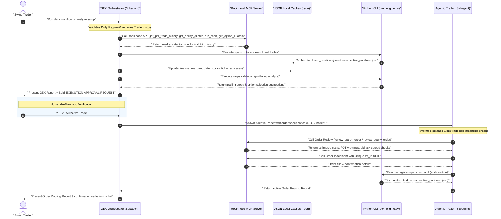
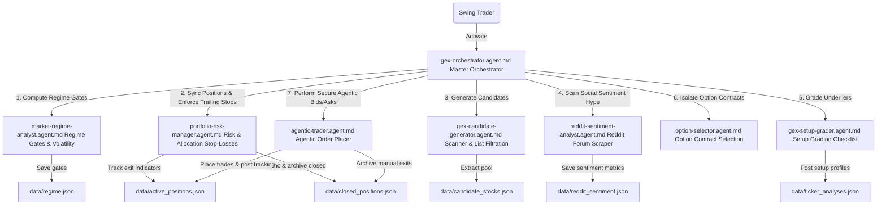
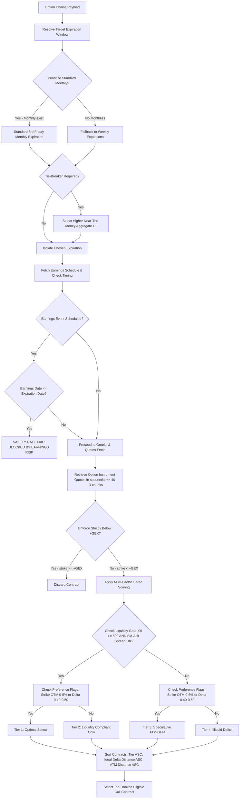
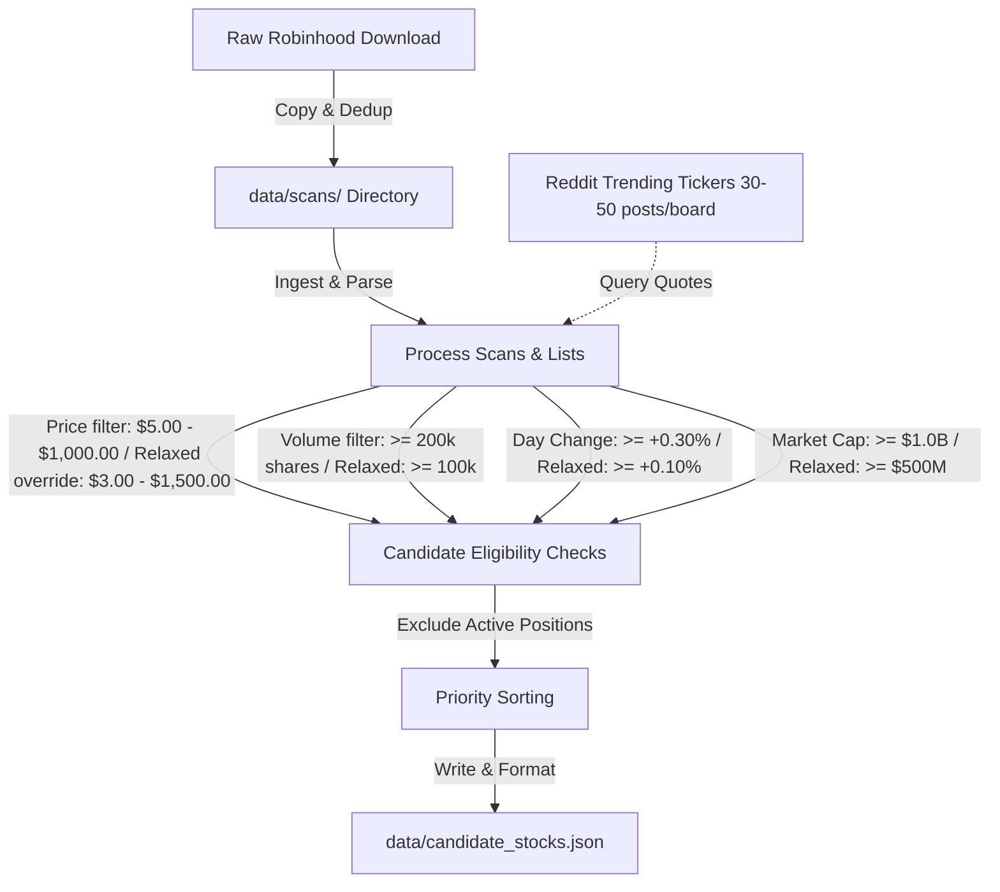
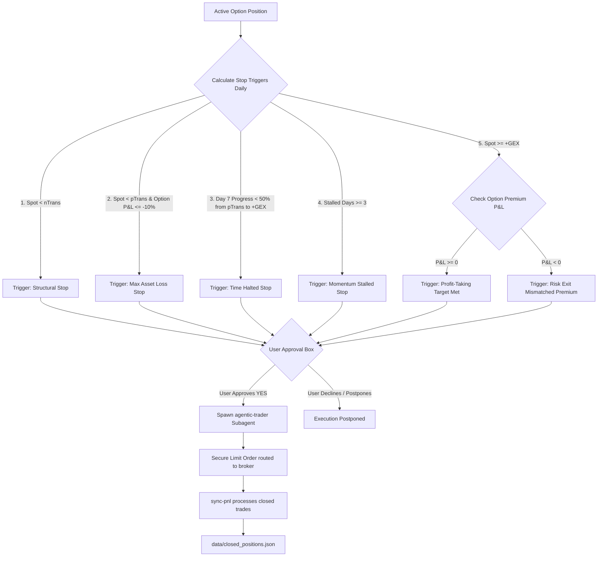

# 📊 GEX Options & Agentic Portfolio Trading Suite

Welcome to the GEX Options & Agentic Portfolio Trading Suite! This repository provides an automated, programmatic mechanical trading workflow that integrates dealer gamma positioning checks, rule-based portfolio risk-management, and secure execution on Robinhood.

The system consists of a **Python mechanical GEX engine CLI** and **specialized Copilot prompts** designed to guide interactive swing-trading decisions, with absolute discipline and zero emotional discretion.

---

## 🦾 Prompt-Driven Execution & Robinhood MCP Server

This trading suite is designed to be executed via **Agentic Chat-Driven Automation** within VS Code, leveraging the **Robinhood MCP (Model Context Protocol) Server** as the primary data-pipeline and execution broker. 

The division of labor is split between the **AI Copilot Agent**, the list of **Local Specialized Prompts**, and the **Local CLI Engine**:



### 1. Model Context Protocol (MCP) Integration
The workspace utilizes an integrated Model Context Protocol (MCP) server bound to Robinhood. This server provides the LLM with direct, runtime capability to fetch real-time market data, pull portfolio allocations, and execute order routing.
- **Data Gathering**: The agent calls `robinhood-trading/get_equity_quotes`, `robinhood-trading/get_option_quotes`, and `robinhood-trading/get_option_positions` dynamically. The returned JSON structures are recorded locally and feed the engine's algorithms.
- **Automated Screening**: The agent calls `robinhood-trading/run_scan` or `robinhood-trading/get_scans` to identify volatility-compression or high-option-volume breakouts.
- **Transaction Routing**: When a setup is `CONFIRMED` and broad-market gates authorization is active (`ALL TRACKS OK`), the agent evaluates portfolio sizing parameters, verifies available buying power via `robinhood-trading/get_accounts`, reviews option price spreads, and routes limit orders securely.

### 2. Specialized LLM Prompts (Prompt-Driven Decisions & Dynamic Delegation)
To enforce strict mechanical discipline and eliminate manual pricing or sizing calculation errors, the targeted, machine-readable user-facing markdown prompt manifests located in the [.github/prompts/](.github/prompts/) directory act as instant delegation handlers. They do not process computations or fetch databases themselves; instead, they immediately delegate the user's active session request to its corresponding dedicated specialist subagent in the [.github/agents/](.github/agents/) directory using the `runSubagent` tool.

These entry points are split into macroscopic workflows (Primary Entry Points) and modular sub-agents that can be called independently to run specific operations ad-hoc:

#### A. Primary Entry Points (End-To-End Macro Workflows)
- [.github/prompts/gex-orchestrator.prompt.md](.github/prompts/gex-orchestrator.prompt.md): Coordinates the comprehensive daily workflow. Evaluates broad-market regime gates, filters scanner candidates, and executes setup grading checklists. Automatically delegates to the **GEX Orchestrator** ([.github/agents/gex-orchestrator.agent.md](.github/agents/gex-orchestrator.agent.md)) subagent.
- [.github/prompts/futures-trading.prompt.md](.github/prompts/futures-trading.prompt.md): Public entrance for pre-market economic macro-catalyst checks, establishing trend-direction biases, formulating Initial Balance setups, and calculating contract sizing brackets. Automatically delegates to the **Futures Trading Analyst** ([.github/agents/futures-trading-analyst.agent.md](.github/agents/futures-trading-analyst.agent.md)) subagent.

#### B. Specialized Sub-Agent Entry Points (Callable Independently)
- [.github/prompts/market-regime-analyst.prompt.md](.github/prompts/market-regime-analyst.prompt.md): Executes the broad market indexing regime gates (SPY/QQQ basket check, Bull:Bear sector breadth ratios, VIX/proxy compression checks). Automatically delegates to the **Market Regime Analyst** ([.github/agents/market-regime-analyst.agent.md](.github/agents/market-regime-analyst.agent.md)) subagent.
- [.github/prompts/portfolio-analysis.prompt.md](.github/prompts/portfolio-analysis.prompt.md): Public entrance for tracking open option/stock positions, validating trailing/time/stalling stops, and auditing portfolio sector weight metrics. Automatically delegates to the **Portfolio Risk Manager** ([.github/agents/portfolio-risk-manager.agent.md](.github/agents/portfolio-risk-manager.agent.md)) subagent.
- [.github/prompts/reddit-sentiment-analyst.prompt.md](.github/prompts/reddit-sentiment-analyst.prompt.md): Public entrance for scraping Wall Street Bets, stocks, and options forums live, calculating sentiment polarity, and tracking dealer-wall divergences. Automatically delegates to the **Reddit Sentiment Analyst** ([.github/agents/reddit-sentiment-analyst.agent.md](.github/agents/reddit-sentiment-analyst.agent.md)) subagent.
- [.github/prompts/gex-candidate-generator.prompt.md](.github/prompts/gex-candidate-generator.prompt.md): Directly manages candidate pool generation, ingesting saved Robinhood scans and sequentially querying watchlists under strict data-matching workarounds. Automatically delegates to the **GEX Candidate Generator** ([.github/agents/gex-candidate-generator.agent.md](.github/agents/gex-candidate-generator.agent.md)) subagent.
- [.github/prompts/gex-setup-grader.prompt.md](.github/prompts/gex-setup-grader.prompt.md): Performs mathematical GEX structural derivation from raw option chain files or parameters to grade ticker setups against the 11-rule checklists. Automatically delegates to the **GEX Setup Grader** ([.github/agents/gex-setup-grader.agent.md](.github/agents/gex-setup-grader.agent.md)) subagent.
- [.github/prompts/option-selector.prompt.md](.github/prompts/option-selector.prompt.md): Initiates targeted live options chain sweeps, runs corporate earnings preflight validation to prevent IV-crush, and isolates optimal Call contracts. Automatically delegates to the **Option Contract Selector** ([.github/agents/option-selector.agent.md](.github/agents/option-selector.agent.md)) subagent.
- [.github/prompts/agentic-trader.prompt.md](.github/prompts/agentic-trader.prompt.md): Performs developer pre-trade clearance checks, liquidity/spread reviews, interactive review/approval gates, and routes limit orders. Automatically delegates to the **Agentic Trader** ([.github/agents/agentic-trader.agent.md](.github/agents/agentic-trader.agent.md)) subagent.

### 3. Sample Execution Output of the GEX Regime Trading Prompt
Below is an authentic sample of the system's final analysis report, generated by executing the [.github/prompts/gex-orchestrator.prompt.md](.github/prompts/gex-orchestrator.prompt.md) daily workflow, rendered directly in markdown preview format:

#### 📅 Cache Freshness Report
- **Daily Regime**: FRESH (2026-07-12)
- **Candidates List**: FRESH (2026-07-12)
- **Active Options**: FETCHED LIVE (2026-07-12T15:45:12Z)
- **Ticker Analyses**: FRESH (2026-07-12)

#### 📊 GEX Regime Check
- **Basket Gate**: 🔴 FAIL (SPY: +0.42%, QQQ: +0.42% - Threshold: SPY or QQQ > +0.50% to PASS)
- **Bull:Bear Gate**: 🟢 PASS (Ratio: 6.50:1 - Bulls: 13, Bears: 2 from [data/regime.json](data/regime.json))
- **VIX Delta Gate**: 🟢 PASS (VIX Spot: 15.03 - Threshold: VIX Spot < Prior Close to PASS)
- **System Authorization**: 🟡 TRACK 1 OK
- **HYG Credit Overlay**: -0.13% (🟢 PASS - No credit/equity divergence)

#### 🛡️ Active Portfolio Tracker & Exits (Current Positions)

##### 🛡️ Active Options Positions (GEX Tracked)
- **SLS**: Current Spot $13.50 vs Average Buy $7.44 (Gain/Loss: -8.60%)
  - **Exits Rule State**: 🔴 STOP TRIGGERED (Max Asset Stop: -10% option loss below pTrans)
  - **Target Mode**: T1 (T1 Target: $14.50)
  - **Distance to Structural Stop (nTrans at $12.50)**: +8.00%
  - **Distance to Max Asset Stop ($13.00)**: +3.85%
  - **Time / Momentum Tracking**: Day 9 of 7 (Status: 🔴 EXPIRED)
  - **Proposed Action**: 🛑 **Immediate Exit** (Triggered Max Asset Protection)

- **BABA**: Current Spot $95.20 vs Average Buy $4.10 (Gain/Loss: -12.20%)
  - **Exits Rule State**: 🛑 UNDERLIER TARGET MET (Option in Loss)
  - **Target Mode**: T1 (T1 Target: $95.00)
  - **Proposed Action**: 🛑 **Immediate Exit** (Target touched, but premium decayed to loss)

##### 📈 Active Stock Positions
- **AMZN**: Current Spot $245.44 vs Average Buy Price $217.80 (Shares: 50.00 | Gain/Loss: +12.69% / +$1,382.00)
  - **Exits Rule State**: 🟢 HOLD (Spot remains supportive of dealer transition levels)
  - **Distance to GEX nTrans Stop (nTrans at $195.00)**: +25.86%
  - **Proposed Action**: ✅ **No Action**

#### 📈 Aggregate Portfolio Summary
- **Total Portfolio Net Liquidation (Net Liq)**: $50,000.00
- **Total Positions Cost Basis**: $11,634.00
- **Total Positions Market Value**: $12,952.00 (25.90% allocation)
- **Total Unrealized P&L**: +$1,318.00 (+11.33%)
- **Cash Buffer / Liquid Reserves**: $37,048.00 (74.10% of Net Liq) | Status: 🟢 PASS

#### 📊 Realized Performance Stats (Closed Trades)
- **Realized Win Rate**: 68.20% (15/22 profitable)
- **Total Realized P&L**: +$4,520.00
- **Profit Factor**: 2.34

#### 📏 Sizing Constraints Checklist
- **Single-Leg Sizing Limit ($\le 3.0\%$ of Net Liq)**: 🟢 PASS
- **Sector Sizing Cap (Tech/Beta $\le 15.0\%$ of Net Liq)**: 🟢 PASS (Total exposure: 6.29%)
- **High Concentration Alert**: 🟢 None

#### 🧠 Reddit Social Sentiment & GEX Divergence Dashboard
- **Scanned Assets**: 12 candidates, 3 active positions
- **Highest Retail Buzz**: NVDA (Sentiment: +0.62)
- **Lowest Retail Buzz / Capitulation**: JBLU (Sentiment: -0.45)

| Ticker | Asset Type | Reddit Buzz | Sentiment (-1 to +1) | Retail Narrative & Catalysts | GEX Alignment / Threat Level | Action Recommendation |
| :--- | :--- | :--- | :--- | :--- | :--- | :--- |
| NVDA | Candidate | High | +0.62 | AI chip demand, Blackwell shipment hype | NEUTRAL / +GEX target at $215.00 | Watch for breakout confirmation |
| JBLU | Candidate | Medium | -0.45 | Yield margin squeeze, fleet capacity fears | 🟢 CAPITULATION WATCH | Monitor pTrans trigger at $4.50 |

##### ⚠️ Key Social Hype & Divergence Alerts:
- 🔴 **NVDA (FOMO WATCH)**: Highly crowded sentiment (+0.62) sits near the primary call wall ($215.00$). Do not chase if spot enters the $+GEX$ overhead zone without deep volume validation.
- 🟢 **JBLU (CAPITULATION WATCH)**: Extreme negative sentiment (-0.45) is converging with heavy secondary put Open Interest at $4.00$. Pre-positioning watch active.

#### 🔍 Scanner Summary
- **Scans Run**: GEX Momentum Candidates, High options volume and IV
- **Candidates Found**: 12 from scanner, 0 from user input = 12 total candidates
- **Filter Metrics**: See [data/candidate_stocks.json](data/candidate_stocks.json)
  - Raw Tickers Sourced: 45
  - Excluded (Already Active): 3
  - Excluded (Price is not $5–$1,000): 12
  - Excluded (Avg Volume < 200,000): 8
  - Excluded (Day Change < +0.3%): 5
  - Excluded (Market Cap < $1B): 5
  - Total Candidates Sourced: 12

#### 🔄 Ticker Analyses Refresh
| Ticker | Spot | Grade | db_change | COTMP Cushion | R/R Ratio | Signal Status |
| :--- | :--- | :--- | :--- | :--- | :--- | :--- |
| JBLU | $5.76 | 11/11 | 0.00 | 30.02% | 0.19:1 | 🔴 BLOCKED (db_change 0.00 < 0.50, R/R ratio 0.19 < 2.00) |
| NVDA | $202.91 | 11/11 | +0.52 | 5.68% | 1.53:1 | 🔴 BLOCKED (Reward/Risk ration 1.53 < 2.00) |

#### 🔍 Setup Breakdown: JBLU
- **Current Spot**: $5.76
- **Key Gamma Levels**:
  - pTrans (Positive Transition): $4.50
  - nTrans (Negative Transition): $4.00
  - +GEX (T1 Target): $6.00
  - COTMP (Center of Put Mass): $4.43
- **Core Filters**:
  1. **Structural Grade**: 11/11 (🟢 PASS)
  2. **db_change (Delta Balance Change)**: 0.00 (🔴 FAIL - Threshold: $\ge 0.50$, or $\ge 0.30$ for Grade 11 DEEP)
  3. **COTMP Cushion**: 30.02% (🟢 PASS - Threshold: $\ge 2.0\%$)
  4. **Spike-Crash Check**: PASS (🟢 No Pattern)
  5. **Risk/Reward Ratio**: 0.19:1 (🔴 FAIL - reward of $0.24$ vs risk of $1.26$)

#### 🚀 Status & Action
- **Signal Status**: 🔴 BLOCKED (failed db_change and Risk/Reward ratio filters)
- **Recommended Play**: None (No action permitted on JBLU)

#### 🔌 Agentic Trade Execution & Approval Box
- **Identified Action**: 🛑 SELL Open Option Portfolio Exit
- **Target Asset / Contract**: SLS / 79cd3800-e848-4d58-8997-308576acad72
- **Preceding Step Recommendation**: Sell SLS 2026-10-16 C14.00 option at $6.80 limit or better to defend remaining capital.
- **Human Approval Status**: 🟡 **AWAITING CONFIRMATION**
- **Action Description**: 
  > **EXECUTION APPROVAL REQUEST**
  >
  > The system has triggered a systematic **Max Asset Stop** exit on **SLS** (Option loss reached -8.60% / Spot price is $13.50 below pTrans level $14.00).
  >
  > **Order Details**:
  > - Ticker: SLS
  > - Contract ID: 79cd3800-e848-4d58-8997-308576acad72
  > - Action: Sell Close Limit (1 Contract)
  > - Limit Price Target: $6.80 (Mid-Mark premium)
  > - Estimated Capital Recovery: $680.00
  > 
  > **Would you like to hand execution for this action over to the Agentic Trader subagent? Please reply with 'YES' to proceed.**

---

## 🤖 Specialized Copilot Subagents Architecture

To maximize precision, separation of concerns, and tool leverage within the workspace, the system has been broken out into a modular, multi-agent cooperative architecture. The **GEX Orchestrator** ([.github/agents/gex-orchestrator.agent.md](.github/agents/gex-orchestrator.agent.md)) acts as the primary user-facing entry point and delegates specific tasks to specialized subagents:



### 🛰️ The Specialized Agent Roster

1. **GEX Orchestrator** ([.github/agents/gex-orchestrator.agent.md](.github/agents/gex-orchestrator.agent.md))
   - **Role**: Primary entry point. Orchestrates the end-to-end workflow, manages interactive chat boundaries, and provides high-level mechanical grading summaries.
2. **Market Regime Analyst** ([.github/agents/market-regime-analyst.agent.md](.github/agents/market-regime-analyst.agent.md))
   - **Role**: Validates Daily Regime Gates (Basket Gate, Bull:Bear breadth ETF pool, VIX spot/proxy compression check) and logs warning reports for credit overlays (HYG).
3. **Portfolio Risk Manager** ([.github/agents/portfolio-risk-manager.agent.md](.github/agents/portfolio-risk-manager.agent.md))
   - **Role**: Syncs active options and stock positions live, tracks holdings, enforces the strict priority-ordered exit stops framework (nTrans, -10% cost basis, 7-day time halving, stalls), and guards technology sector portfolio allocation boundaries ($\le 15.0\%$ cumulative).
4. **GEX Candidate Generator** ([.github/agents/gex-candidate-generator.agent.md](.github/agents/gex-candidate-generator.agent.md))
   - **Role**: Sources candidates from saved Robinhood scanners and sequential-safe watchlist retrieves (100 most popular, Daily movers, Popular recurring investments, IPO Access), applies manual screening parameter buffers, and filters active open positions.
5. **Reddit Sentiment Analyst** ([.github/agents/reddit-sentiment-analyst.agent.md](.github/agents/reddit-sentiment-analyst.agent.md))
   - **Role**: Sweeps wallstreetbets, stocks, options, investing, and spacs forums live to calculate sentiment scores ($\pm 1.0$) and discussion volume buzz, projecting retail hype against dealer call walls to generate FOMO/capitulation divergence alerts.
6. **GEX Setup Grader** ([.github/agents/gex-setup-grader.agent.md](.github/agents/gex-setup-grader.agent.md))
   - **Role**: Computes mathematical proxies (pTrans, nTrans, +GEX, COTMP, realized/implied volatilities) from safe 40-contract chunk option chains, and grades setup profiles out of 11 system rules.
7. **Option Contract Selector** ([.github/agents/option-selector.agent.md](.github/agents/option-selector.agent.md))
   - **Role**: Analyzes live options chains and greeks, checks company earnings release date preflights to prevent IV crush, and isolates specific highly liquid ATM/OTM target call contracts matching strict bid-ask limits.
8. **Agentic Trader** ([.github/agents/agentic-trader.agent.md](.github/agents/agentic-trader.agent.md))
   - **Role**: Validates agentic account permissions, performs asset tradability checks, simulates reviews (dry-runs), places broker limit orders (equities/options), and registers positions securely in the local database.
9. **Futures Trading Analyst** ([.github/agents/futures-trading-analyst.agent.md](.github/agents/futures-trading-analyst.agent.md))
   - **Role**: Performs pre-market economic macro scans (Tier 1 catalysts), establishes trend biases ($200\text{ SMA}$/$21\text{ EMA}$), identifies Initial Balance / VWAP setups, and computes contract/bracket position sizes.

---

## Getting Started

The GEX Options Trading Suite is fully optimized for interactive **AI-Driven Session Management**.

### 1) Prerequisites
- Python 3.8 or higher.
- A functional terminal or shell environment.
- A configured **Robinhood MCP Server** active in your VS Code workspace storage.
- (Highly Recommended) **GitHub Copilot CLI** installed in your system terminal environment.

### 2) AI-Driven Interactive Execution (Recommended)
You do not need to manually compute formulas, run complicated commands, or memorize subcommand flags. The specialized subagents automate the entire workflow. 

Simply open the Copilot Chat workspace in VS Code and activate the primary macro prompts or specialized sub-agent handlers:
* **Run Daily Diagnostics**: Load the broad market regime gates and grader pool via [.github/prompts/gex-orchestrator.prompt.md](.github/prompts/gex-orchestrator.prompt.md).
* **Audit Open Portfolio Exits**: Run trailing and stalling mechanical stop checks by loading [.github/prompts/portfolio-analysis.prompt.md](.github/prompts/portfolio-analysis.prompt.md).
* **Analyze Focus Symbol setups**: Request a specific spot grading checklist by asking Copilot to evaluate a ticker using the [.github/prompts/gex-setup-grader.prompt.md](.github/prompts/gex-setup-grader.prompt.md) criteria.

### 3) Background Automation & Workflows Scheduling
To maintain complete systematic risk overlays, avoid calculation bypasses, and ensure that every automated run benefits from complete AI-driven reasoning and Reddit sentiment overlays, **do not execute the raw python CLI script directly in your schedulers.** 

Instead, schedule the execution of the main workflow entry prompt, **[.github/prompts/gex-orchestrator.prompt.md](.github/prompts/gex-orchestrator.prompt.md)**, via **GitHub Copilot CLI** and your system's scheduler (cron or Task Scheduler):

#### Multi-OS Scheduling via GitHub Copilot CLI & OS Schedulers
You can use Copilot CLI to suggest and register exact scheduling wrappers that feed your prompt files directly into the Copilot runtime environment.

##### 1. Unix / macOS / Linux (cron + gh copilot)
Run this command in terminal to suggest a background automated cron config:
```bash
gh copilot suggest "generate a crontab entry that passes .github/prompts/gex-orchestrator.prompt.md to the gh copilot query engine every weekday at 3:45 PM EST"
```
Or append it manually to your user crontab (`crontab -e`), matching your absolute path details:
```cron
# Run GEX Daily Regime & setup analysis automatically at 3:45 PM EST (20:45 UTC) every weekday
45 15 * * 1-5 cd /absolute/path/to/wip && gh copilot explain "/absolute/path/to/wip/.github/prompts/gex-orchestrator.prompt.md" >> logs/agentic_trading_run.log 2>&1
```

##### 2. Windows (Task Scheduler + PowerShell + gh copilot)
Run this command in terminal to suggest a PowerShell Register-ScheduledTask command:
```bash
gh copilot suggest "generate a Register-ScheduledTask command to run gh copilot using .github/prompts/gex-orchestrator.prompt.md every weekday at 3:45 PM EST"
```

---

## 🤖 GEX Profile Derivation Engine

The `analyze` subcommand supports automatic offline GEX structural profile and volatility derivation directly from raw Robinhood files. Rather than manually computing levels or volatility rules, you can optionally pass paths to the downloaded options instruments file (`--inst-file`), options quotes metrics file (`--quote-file`), and historical daily closes file (`--hist-file`).

```bash
python3 src/gex_engine.py analyze SUPN --spot 50.25 --inst-file data/downloads/20260708/supn_option_instruments_raw.json --quote-file data/downloads/20260708/supn_option_quotes_raw.json --hist-file data/downloads/20260708/supn_historicals_raw.json --db-change 0.65
```

### Derivation Mechanics
1. **COTMP (Center of Put Mass)**: Calculated as the Open Interest (OI)-weighted average strike price of all puts.
2. **pTrans (Positive Transition)**: Resolved as the strike price at or below the current Spot price that contains the highest put Open Interest.
3. **nTrans (Negative Transition)**: Resolved as the strike price strictly below `pTrans` containing the next largest concentration of put Open Interest. This serves as the structural capital protection floor.
4. **+GEX (T1 Target)**: Resolved as the strike price at or above the current Spot price containing the highest call Open Interest (the main dealer/call wall).
5. **Implied vs. Realized Volatility (Rule 8)**: Calculated using options quotes within 15% of spot to compute log-return standard deviation over the full price history.
6. **10-day Realized Volatility Compression (Rule 11)**: Calculated using the standard deviation of log returns over the last 10 trading session closes.

### 🎯 Option Selection & Portfolio Sizing Simulation
When option profiles are successfully derived via `--inst-file` and `--quote-file`, the system automatically executes the **Option Selection Protocol** and a **Sizing Constraints Simulator**:



#### 1) Option Selection Protocol (Tiered Sorting & Liquidity Filters)
The option selection process is designed to handle live option chain data with complete mechanical precision. It operates based on the following specific pipeline:
- **Expiration Date Determination**:
  - Isolate the contract maturity closest to **30 to 45 calendar days** out (or custom target ranges via `--min-dte` and `--max-dte`).
  - Prioritizes standard monthly maturities (traditionally the third Friday of each month); falls back to weekly expirations only when no standard monthly dates fall within the target window. Short-term weekly options under 14 days are strictly excluded.
  - **Tie-Breaker Rule**: If multiple expirations are at equal distance from the target window, the standard monthly contract is chosen. If both are monthlies (or both are weeklies), the contract with the highest aggregate near-the-money strike Open Interest (OI) is selected.
- **Intelligent Earnings & IV Crush Preflight Gate**:
  - Dynamically extracts scheduled or estimated earnings dates from the underlier's corporate schedule database.
  - Generates robust date resolutions supporting full ISO-8601 timestamps (handling timezone offsets and fractional precision) and filters out past events to select the **earliest upcoming/future quarterly event**.
  - **The Earnings Risk Block**: If an upcoming earnings release falls **before or on** the target option's expiration date, the contract is labeled **BLOCKED BY EARNINGS RISK** (`[SAFETY GATE FAIL]`) to protect the position from catastrophic volatility crush (IV collapse immediately post-announcement).
- **Chunked Data Transmission**:
  - Automatically splits candidate call option instrument IDs into query chunks of **at most 40 contract IDs** before calling the quote retrieval endpoints to strictly prevent HTTP 414 "Request-URI Too Large" failures.
- **Strict +GEX Overhead Target Boundary**:
  - To secure viable drift room for the trade breakout, the selected strike **must be strictly below** the active `+GEX` (T1 Target) level retrieved from [data/ticker_analyses.json](data/ticker_analyses.json).
- **Mechanical Tiered Scoring Framework**:
  Assigns and grades each Call option contract to one of four mutually exclusive Tiers (lower index is superior) based on liquidity metrics and strike preferences:
  1. **Tier 1 (Optimal Select)**: Liquidity Passed AND (Strike Preferred OR Delta Preferred).
  2. **Tier 2 (Liquidity Compliant Only)**: Liquidity Passed but neither preference flag is met.
  3. **Tier 3 (Speculative ATM/Delta)**: Liquidity Fails but (Strike Preferred OR Delta Preferred).
  4. **Tier 4 (Illiquid Deficit)**: Liquidity Fails and neither preference flag is met.
  
  *Where:*
  - **Liquidity Passed Check**: Requires contract Open Interest (OI) $\ge 500$ AND a tight bid-ask spread (Spread $\le \$0.15$ for premiums $\le \$2.00$, Spread $\le \$0.25$ for premiums between $\$2.01$ and $\$5.00$, or Spread $\le 10\%$ of bid/mark for premiums $>\$5.00$).
  - **Strike Preferred Flag**: Underlier spot is ATM or slightly OTM ($0.0\%$ to $+5.0\%$ above current Spot).
  - **Delta Preferred Flag**: If Delta is present, it must fall within $\pm 0.05$ of the **0.45** target (delta range 0.40--0.50).
- **Multi-Factor Sorting Hierarchy**:
  Contracts are sorted sequentially by **Tier** (ascending, lower is better), **Distance to Target Delta** (minimizing absolute difference from 0.45 target when Delta is present), and **Distance to Spot** (minimizing absolute distance from At-The-Money to break remaining ties).

#### 2) Sizing Constraints Simulator
Automatically calculates recommended contract counts based on single-leg $\le 3.0\%$ portfolio Net Liquidation Rules. The portfolio value defaults to $\$50{,}000.00{}$ but can be customized using the `--net-liq` argument:
```bash
python3 src/gex_engine.py analyze SUPN --spot 50.25 --inst-file data/downloads/20260708/supn_option_instruments_raw.json --quote-file data/downloads/20260708/supn_option_quotes_raw.json --hist-file data/downloads/20260708/supn_historicals_raw.json --db-change 0.65 --net-liq 125000 --target-delta 0.50 --min-dte 30 --max-dte 60
```

---

## 📅 GEX Candidates Sourcing & `update-candidates` Pipeline

The `update-candidates` command runs an end-to-end ingestion and filtering pipeline for screeners and candidates:



### Dynamic Ingestion and Archiving
When `update-candidates` is run, the engine:
1. Searches the current directory and recursive [data/downloads](data/downloads) subdirectory for any new JSON files.
2. Inspects their schemas to identify native Robinhood scanner data blocks.
3. Translates, copies, and timestamps them into [data/scans](data/scans) and [data/scans/history](data/scans/history) respectively to establish offline local scan databases. It also dynamically discovers and processes any valid active scan files placed inside [data/scans](data/scans) (such as Top Gainers Today) automatically alongside standard ones.
4. Custom filters and prioritizes the pooled candidate tickers, writing the consolidated output directly to [data/candidate_stocks.json](data/candidate_stocks.json).
5. Deletes temporary JSON logs from the workspace root to preserve strict repository cleanliness.

### Standard Mechanical Screener Baseline & Custom Overrides
Candidate stocks are filtered locally according to robust baseline filters, which can be fully customized or overridden via command-line arguments (including the relaxed defaults configured in core agents):
- **Price Range** (override with `--min-price` and `--max-price`): Underlier spot price boundaries, defaulting to a range of $\$5.00$ to $\$1{,}000.00$ (with relaxed ranges down to $\$3.00$ up to $\$1{,}500.00$ supported by agents).
- **Daily Volume** (override with `--min-volume`): Minimum average trading volume, defaulting to $200{,}000$ shares (relaxed down to $100{,}000$ shares by agents).
- **Session Percent Change** (override with `--min-change`): Minimum session daily gain percentage, defaulting to $+0.3\%$ (relaxed down to $+0.10\%$ by agents).
- **Market Capitalization** (override with `--min-market-cap`): Minimum equity market cap, defaulting to $\$1.0\text{ Billion}$ (relaxed down to $\$500\text{ Million}$ by agents).
- **Exclusion**: Tickers of open contracts currently stored in [data/active_positions.json](data/active_positions.json) are dynamically omitted to avoid concentration and focus capital.

To invoke candidate updates with tighter custom filters, run:
```bash
python3 src/gex_engine.py update-candidates --min-volume 500000 --min-change 0.5 --min-market-cap 2000000000
```


---

## 📐 The 11 Rules of GEX Options Trading System Setup Grading

The core mechanics of the suite's quantitative setup grading program evaluate candidate equities based on 11 objective structural and market-depth checks. A Grade of $\ge 9$ is required for entry authorization; any score $\le 8$ is a hard block.

| Rule Index | Checklist Rule | Logic & Implementation Details |
| :---: | :--- | :--- |
| **Rule 1** | Total Call GEX is Positive | Validates that broad net-dealer gamma positioning for the underlier is positive, indicating a supportive market microstructure. |
| **Rule 2** | Call GEX > Absolute Put GEX | Checks if bullish upside-hedging flow exceeds bearish downside-hedging flow. |
| **Rule 3** | Spot Price > COTMP | Enforces that underlier Spot sits above the Center of Put Mass, establishing that it resides above the core downside hedging firewall. |
| **Rule 4** | Target +GEX Strike > Spot | Verifies that the primary $+GEX$ target strike (T1 Target) sits above the spot price, defining a viable upside trajectory. |
| **Rule 5** | pTrans > nTrans | Checks that the Positive Transition boundary resides above the Negative Transition floor. |
| **Rule 6** | Spot Price > pTrans | Enforces the entry trigger condition. Safe watchdowns allow pending triggers near this boundary. |
| **Rule 7** | Total Open Interest > 10,000 | Confirms option chain depth and liquidity to avoid wide bid/ask spreads. |
| **Rule 8** | Implied Volatility (IV30) < Realized Volatility (HV90) | Checks that option pricing is structurally undervalued relative to historical movement, indicating favorable premium entry conditions. |
| **Rule 9** | OI Depth at Target Strike | Validates that Open Interest at the targeted $+GEX$ strike exceeds other nearby option strikes. |
| **Rule 10** | Net Spot Gamma is Positive | Verifies that dealer positioning at the underlier's closest-to-the-money strike is net positive. |
| **Rule 11** | 10-day Realized Volatility <= 35% | Confirms volatility compression on the underlier, laying the groundwork for clean explosive breakouts. |

---

## 🛡️ Portfolio Risk-Management & Exit Stops

The `portfolio` subcommand automatically tracks trailing/loss stops, progress metrics, and overall concentration caps. It enforces five strict programmatic exit rules to lock in profits and contain downside risk. To eliminate human discretion and guarantee capital protection, these rules are evaluated in a **strict sequential priority queue** where defensive and protective halts always take absolute precedence over profit targets:



### 🛑 Sequential Evaluation & Priority Protection
If a defensive or trailing stop is triggered, any subsequent profit-taking evaluations are **fully blocked**. This prevents severely decayed or stalled option positions that happen to witness a late-stage underlying bounce from erroneously displaying a successful profit-take recommendation. Furthermore, if a position touches its target strike but has decayed into a loss, the system flags it as a risk-reduction exit to prevent holding a structurally mismatched position.

### Programmatic Stop-Loss Trigger Specifications

1. **Structural Stop (nTrans Floor)**
   - **Condition**: Spot price breaks below `nTrans`.
   - **Priority**: **Tier 1 (Highest)**.
   - **Action**: Immediate Exit. This stop respects structural dealer walls; breaking them invalidates the setup.

2. **Max Asset Loss Protection Stop**
   - **Condition**: Spot price is below `ptrans` and option total return drops to $\le -10.0\%$.
   - **Priority**: **Tier 2**.
   - **Action**: Immediate Exit. Ensures capital preservation while waiting for a pending setup to breakout.

3. **Time-Halted Progress Stop (7-Day Limit)**
   - **Condition**: By Day 7, the stock's spot progress relative to its positive breakout level is under $50\%$:
     $$\text{Progress \%} = \frac{\text{Spot} - \text{pTrans}}{\text{+GEX} - \text{pTrans}} \times 100 < 50.0\%$$
   - **Priority**: **Tier 3**.
   - **Action**: Close out position immediately. Avoids tying up portfolio capital in stale, grinding consolidations.

4. **Momentum Stalling Stop**
   - **Condition**: Underlier achieves $< 10\%$ daily momentum for three consecutive session updates.
   - **Priority**: **Tier 4**.
   - **Action**: Immediate Exit. Re-allocates funds to names showing fresh momentum flow.

5. **Profit-Taking Target Stop**
   - **Condition**: Underlier Spot price touches or exceeds the `+GEX` (T1 Target) strike.
   - **Priority**: **Tier 5 (Lowest)**.
   - **Action**: 
     - **Option Premium is in Profit**: Exit for $100\%$ gains, or trail the stop to the original option entry premium to target the secondary structural `T2` level.
     - **Option Premium is in Loss**: Exit position immediately to limit further losses (flags a structural/time mismatch).

---

## 🤝 Interactive Order Execution Handoff & Human Approval

To maintain strict risk control, prevent trade execution slippage, and securely route orders, the GEX master orchestrator uses a rules-based handoff process with mandatory **human-in-the-loop validation**:

1. **Preceding Setup Actions**:
   - **Entries**: When a setup is classified as `CONFIRMED` or `PENDING` (Step 6) and recommends a `"Buy Option contract"` action, the Orchestrator identifies the targeted ATM/OTM call contract and estimated sizing criteria.
   - **Exits**: When an active position triggers a stop or a trailing/profit-taking exit (Step 7), the Orchestrator isolated the specific trigger parameter (`Structural`, `Max Loss`, `Time Stop`, `Stalling`, or `Profit Take`) to determine the target exit action.
2. **Approval Request Box**:
   - The Orchestrator displays a prominent, bold `EXECUTION APPROVAL REQUEST` detailing the trade parameters, underlier spot, bid/ask spreads, and recommended price boundaries.
   - It prompts the user: "Would you like to hand execution for this action to the Agentic Trader subagent? Please reply with 'YES' to proceed."
3. **Subagent Execution Routing**:
   - Only upon detecting an explicit affirmative validation (such as `"YES"`) does the Orchestrator delegate execution by spawning the `agentic-trader` subagent via the subagent tool.
   - The `agentic-trader` subagent verifies real-time permissions, executes pre-trade quotes/bids comparison, routes limit orders to broker channels, registers/registers the executed position locally in [data/active_positions.json](data/active_positions.json), and delivers an institutional-grade routing report.

---

## 📏 Portfolio Recommendation Framework

When executing portfolio reviews manually or via [.github/prompts/portfolio-analysis.prompt.md](.github/prompts/portfolio-analysis.prompt.md), apply the following standard mechanics:

- **Trim or Reduce**: Any position exceeding $15\text{--}20\%$ of net liquidation value to contain concentration risk.
- **Add Sector Hedges**: Offset technology-biased exposure using broad-market instruments (e.g., Core S&P 500 or Total Stock Market indexes).
- **Enforce Single-Leg Limits**: Keep option sizing at $\le 3.0\%$ of Net Liq per position and cap technology beta at $\le 15.0\%$ cumulative.
- **Maintain Liquidity**: Always preserve a cash buffer for near-term flexibility.

---

## Repository Components

This workspace is structured as follows:

1. **Python Mechanical GEX Engine**:
   - [src/gex_engine.py](src/gex_engine.py): The main execution script. It enforces dynamic options analyses, status updates, portfolio trailing/loss stops, and tracks risk allocations.
2. **Persistent Local Cache Databases**:
   - [data/regime.json](data/regime.json): Holds the computed status, gates, and metrics for the broad market Daily Regime Gates.
   - [data/ticker_analyses.json](data/ticker_analyses.json): Accumulates setup grading metrics (Spot, transition levels, Delta Balance change thresholds). See the [data/ticker_analyses.json](data/ticker_analyses.json) [Schema Documentation](#-dataticker_analysesjson-schema-documentation) below for the complete specification.
   - [data/active_positions.json](data/active_positions.json): Records open options positions, premium tracking, holding period, and stalling status. See the [data/active_positions.json](data/active_positions.json) [Schema Documentation](#-dataactive_positionsjson-schema-documentation) below for the complete specification.
   - [data/reddit_sentiment.json](data/reddit_sentiment.json): Local storage for Reddit social sentiment volume metrics and narrative catalysts per ticker.
3. **Specialized Copilot Subagents** (located in the [.github/agents/](.github/agents/) directory):
   - [.github/agents/gex-orchestrator.agent.md](.github/agents/gex-orchestrator.agent.md): Primary user-facing orchestrator. Coordinates the automated end-to-end evaluation workflow and coordinates setup grading.
   - [.github/agents/market-regime-analyst.agent.md](.github/agents/market-regime-analyst.agent.md): Computes indexing regime gates (Basket Gate, Bull:Bear sector ETF ratios, VIX/proxy compression checks) and monitors HYG credit spreads.
   - [.github/agents/portfolio-risk-manager.agent.md](.github/agents/portfolio-risk-manager.agent.md): Syncs option/stock positions live, tracks holdings, enforces strict priority-ordered exits (nTrans support, -10% stop, time stops, stalling indicators), and guards portfolio net collateral allocation limits.
   - [.github/agents/gex-candidate-generator.agent.md](.github/agents/gex-candidate-generator.agent.md): Automates ingestion of saved filters and sequential list retrieval to construct and prioritize candidate databases.
   - [.github/agents/reddit-sentiment-analyst.agent.md](.github/agents/reddit-sentiment-analyst.agent.md): Conducts social polling across r/wallstreetbets, r/options, and r/stocks using `mcp-reddit` to map crowd polarity scores ($\pm 1.0$) against GEX support/barrier walls.
   - [.github/agents/gex-setup-grader.agent.md](.github/agents/gex-setup-grader.agent.md): Extracts structural GEX proxies (pTrans, nTrans, +GEX, COTMP) from chunked option chain sweeps, and runs the 11-rule checklists.
   - [.github/agents/option-selector.agent.md](.github/agents/option-selector.agent.md): Queries options chains and Greeks, runs earnings calendar preflights, and isolates optimal Call contracts.
   - [.github/agents/agentic-trader.agent.md](.github/agents/agentic-trader.agent.md): Runs pre-trade clearance checks, reviews option spreads, reviews contract liquidity, simulates dry-runs, and routes secure limit orders.
   - [.github/agents/futures-trading-analyst.agent.md](.github/agents/futures-trading-analyst.agent.md): Evaluates economic catalysts, trends, Initial Balance boundaries, and calculates precise contract-sizing parameters.
4. **Specialized Copilot Prompt Manifests (Delegation Layer)** (located in the [.github/prompts/](.github/prompts/) directory):
   
   **Primary Entry Points (Macro End-To-End Workflows):**
   - [.github/prompts/gex-orchestrator.prompt.md](.github/prompts/gex-orchestrator.prompt.md): Public entrance for daily broad market regime checks, scanning, and candidate setup grading. Delegates directly to the **GEX Orchestrator** subagent.
   - [.github/prompts/futures-trading.prompt.md](.github/prompts/futures-trading.prompt.md): Public entrance for futures pre-market Trend biases, Initial Balance ranges, and size calculations. Delegates directly to the **Futures Trading Analyst** subagent.

   **Specialized Sub-Agent Entry Points (Callable Independently):**
   - [.github/prompts/market-regime-analyst.prompt.md](.github/prompts/market-regime-analyst.prompt.md): Independent entrance for executing broad market indexing regime gates (SPY/QQQ basket, Bull:bear sector ratios, and VIX compression rules). Delegates directly to the **Market Regime Analyst** subagent.
   - [.github/prompts/portfolio-analysis.prompt.md](.github/prompts/portfolio-analysis.prompt.md): Public entrance for portfolio syncing, trailing/time/stalling stops audits, and allocation checks. Delegates directly to the **Portfolio Risk Manager** subagent.
   - [.github/prompts/reddit-sentiment-analyst.prompt.md](.github/prompts/reddit-sentiment-analyst.prompt.md): Public entrance for live Reddit community sentiment sweeps and divergence tracking. Delegates directly to the **Reddit Sentiment Analyst** subagent.
   - [.github/prompts/gex-candidate-generator.prompt.md](.github/prompts/gex-candidate-generator.prompt.md): Independent entrance for generating candidate pools from saved scans and safe sequential watchlists. Delegates directly to the **GEX Candidate Generator** subagent.
   - [.github/prompts/gex-setup-grader.prompt.md](.github/prompts/gex-setup-grader.prompt.md): Independent entrance for offline GEX levels computation (COTMP, pTrans, nTrans, +GEX) and quantitative 11-rule checklists. Delegates directly to the **GEX Setup Grader** subagent.
   - [.github/prompts/option-selector.prompt.md](.github/prompts/option-selector.prompt.md): Independent entrance for target Call option selection, liquidity filters, and earnings IV-crush preflights. Delegates directly to the **Option Contract Selector** subagent.
   - [.github/prompts/agentic-trader.prompt.md](.github/prompts/agentic-trader.prompt.md): Independent entrance for running pre-trade clearance checks, reviews, dry-runs, and limit order execution. Delegates directly to the **Agentic Trader** subagent.

---

## 🦾 Running the CLI Engine (Low-Level Reference)

The core execution script is [src/gex_engine.py](src/gex_engine.py). It operates via subcommands to parse different mechanical gates:

#### Check broad market authorization regime:
```bash
python3 src/gex_engine.py status
```

#### Recompute the Daily Regime Gates from raw market inputs:
```bash
python3 src/gex_engine.py update-regime --spy 0.62 --qqq 1.10 --bulls 120 --bears 35 --vix-bearish True --vix-spot 15.20
```
Or automatically derive all SPY, QQQ and Sector breadths from a downloaded Robinhood ETF Quotes file:
```bash
python3 src/gex_engine.py update-regime --etf-file data/downloads/20260708/etf_quotes.json --vix-bearish True --vix-spot 15.20
```
Gates are computed mechanically: **Basket** (SPY or QQQ > $+0.5\%$), **Bull:Bear** (ratio $> 3.0{:}1$), **VIX Delta** (dealer positioning bearish on VIX). Authorization resolves to `ALL TRACKS OK` (3/3), `TRACK 1 OK` (2/3), or `BLOCKED`.

#### Dynamically grade a quantitative GEX setup:
```bash
python3 src/gex_engine.py analyze AAPL --spot 289.55 --ptrans 285.00 --ntrans 282.00 --gex 310.00 --cotmp 280.00 --db-change 0.55
```
Or leverage advanced parameterized option selection parameters to target particular durations or delta zones:
```bash
python3 src/gex_engine.py analyze AAPL --spot 289.55 --ptrans 285.00 --ntrans 282.00 --gex 310.00 --cotmp 280.00 --db-change 0.55 --target-delta 0.50 --min-dte 30 --max-dte 60
```
*(Optionally, GEX transition levels can be dynamically derived from option chain payloads: see the section below).*

#### Pull and process new Robinhood scans to update candidate pool:
```bash
python3 src/gex_engine.py update-candidates
```
*(This scans the repository for raw temporary JSON downloads, formats and saves them inside the scans directory, filters and ranks candidates, and populates the database).*

#### Run mechanics and trailing stops on active options positions:
```bash
python3 src/gex_engine.py portfolio
```

#### Manually append a new tracked contract:
```bash
python3 src/gex_engine.py add-position <option_id> <ticker> <strike> <expiration> <type> <purchase_premium>
```

#### Update specific contract tracking metrics:
```bash
python3 src/gex_engine.py update-option <option_id_or_ticker> --mark <mark_price> --days <days_held>
```

#### Close a tracked contract and archive realized P&L:
```bash
python3 src/gex_engine.py close-position <option_id_or_ticker> --close-premium <exit_premium>
```

#### Manually register an open stock position:
```bash
python3 src/gex_engine.py add-stock <ticker> <shares> <average_buy_price> [--sector <sector>]
```

#### Update cached stock tracking metrics:
```bash
python3 src/gex_engine.py update-stock <ticker> [--price <price>] [--shares <shares>] [--sector <sector>]
```

#### Close a tracked stock position and archive standard P&L:
```bash
python3 src/gex_engine.py close-stock <ticker> [--close-price <close_price>]
```

#### Sync trade history to automatically detect and archive closed positions:
```bash
python3 src/gex_engine.py sync-pnl [--pnl-file <path_to_trade_history>]
```
*(This loads a downloaded Robinhood chronological P&L trade history file, compares it with currently tracked options and stocks, migrates any matching closed trades over to [data/closed_positions.json](data/closed_positions.json), and cleans [data/active_positions.json](data/active_positions.json). If no path is supplied, it automatically searches lexicographically within [data/downloads](data/downloads) to ingest the newest trade file).*

#### Display detailed terminal report and win-loss statistics of all closed positions:
```bash
python3 src/gex_engine.py closed
```
*(This aggregates all closed options and stock positions stored in [data/closed_positions.json](data/closed_positions.json), rendering an aligned execution grid with duration, cost basis, realized return in dollars and percentage, alongside overall strategy stats such as profit factors, Win Rates, expectancy, and mathematical expectancies).*

#### Run an offline option payoff simulation scenario grid:
```bash
python3 src/gex_engine.py payoff <symbol> --spot <spot_price> --strike <strike_price> --mark <current_mark_premium> [--delta <delta_value>] [--gamma <gamma_value>] [--dte <days_to_expiration>] [--target-spots <comma_separated_prices>]
```
*(This allows you to simulate extrinsic time-decay and underlier moves ad-hoc, rendering a beautiful visual scenarios matrix with delta/gamma calculations adjusted for days held).*

#### Display Reddit sentiment analysis dashboard and GEX divergence alerts:
```bash
python3 src/gex_engine.py sentiment
```

#### Register/update Reddit sentiment data for a ticker (including 5-factor scoring components):
```bash
python3 src/gex_engine.py update-sentiment <ticker> --score <score> --buzz <buzz> --narrative <narrative> [--tone <tone>] [--comments <comments>] [--position <position>] [--volume-score <volume_score>] [--meme <meme>]
```
*(Options for `--buzz` include `High`, `Medium`, `Low`, or `None`. `--score` must be between `-1.0` (capitulation/panic) and `+1.0` (FOMO/euphoria). Optional 5-factor inputs include: `--tone` (-0.30 to +0.30), `--comments` (-0.30 to +0.30), `--position` (-0.20 to +0.20), `--volume-score` (-0.10 to +0.10), and `--meme` (-0.10 to +0.10). The sum of these 5-factor components must match the overall sentiment `--score` within ±0.02 when any are provided).*

#### Display a beautiful ranked report of all historically analyzed ticker setups:
```bash
python3 src/gex_engine.py rankings [--status <ALL/CONFIRMED/PENDING/BLOCKED>] [--min-grade <0-11>] [--sort <grade/spot/cushion/rr/status>]
```
*(This loads all historically stored quantitative candidate gradings inside [data/ticker_analyses.json](data/ticker_analyses.json), filters them by minimum grade or signal status, sorts them according to your custom preferences, and renders a stunningly aligned terminal board including current execution-readiness validations).*

---

## 🗄️ [data/active_positions.json](data/active_positions.json) Schema Documentation

The cache file [data/active_positions.json](data/active_positions.json) acts as the local storage layer tracking active options contracts and stock holdings, along with sizing calculations, P&L calculations, and duration parameters.

### Schema Definition
```json
{
  "options_positions": {
    "<Option_ID_UUID>": {
      "Option ID": "79cd3800-e848-4d58-8997-308576acad72",
      "Underlier": "NKE",
      "Strike": "40.00",
      "Expiration": "2026-10-16",
      "Type": "call",
      "Purchase Premium": "4.75",
      "Delta": "0.734159",
      "Gamma": "0.036034",
      "Mark Price": 6.15,
      "Open Interest": 1317,
      "ImpVol": "0.389144",
      "Asset Cost Basis": 475.0,
      "Current Value": 615.0,
      "P&L (%)": 29.47,
      "P&L ($)": 140.0,
      "Sizing Risk Weight (%)": 0.92,
      "Beta Sector Tag": "Consumer Cyclical",
      "Days Held": 1,
      "Stalling Days": 0,
      "Underlier Spot": 42.89,
      "Entry Date": "2026-06-29"
    }
  },
  "stocks_positions": {
    "<TICKER>": {
      "Ticker": "AAPL",
      "Shares": 10.0,
      "Average Buy Price": 150.0,
      "Current Price": 314.54,
      "Beta Sector Tag": "Technology/Beta",
      "Entry Date": "2026-07-09",
      "Asset Cost Basis": 1500.0,
      "Current Value": 3145.40,
      "P&L ($)": 1645.40,
      "P&L (%)": 109.69,
      "Sizing Risk Weight (%)": 3.00
    }
  }
}
```

### Parameter Details (Options Positions)

| Field | Type | Description |
| :--- | :--- | :--- |
| `Option ID` | String | Unique contract tracking UUID sourced from Robinhood's instrument list. |
| `Underlier` | String | Capitalized ticker symbol of the underlying equity asset (e.g. `AAPL`). |
| `Strike` | String | Option contract target purchase strike price. |
| `Expiration` | String | Contract maturity date encoded in `YYYY-MM-DD` sequence. |
| `Type` | String | Option transaction parameter: `"call"` or `"put"`. |
| `Purchase Premium` | Decimal | Premium price per contract paid on order execution. |
| `Delta` | String | Real-time rate of option price change relative to underlying changes. |
| `Gamma` | String | Underlier-hedging rate of change tracking speed. |
| `Mark Price` | Float | Most recent mid-market price valuation of the contract. |
| `Open Interest` | Int | Cumulative counter tracking total active contracts. |
| `ImpVol` | String | Real-time Black-Scholes implied volatility (IV). |
| `Asset Cost Basis` | Float | Total original purchase capital committed ($\text{Purchase Premium} \times 100$). |
| `Current Value` | Float | Standard live market value of the contract ($\text{Mark Price} \times 100$). |
| `P&L (%)` | Float | Relative total return calculated directly from cost basis and mark price. |

### Parameter Details (Stock Positions)

| Field | Type | Description |
| :--- | :--- | :--- |
| `Ticker` | String | Capitalized ticker symbol of the equity asset (e.g. `AAPL`). |
| `Shares` | Float | Nominal count of stock shares held. |
| `Average Buy Price` | Float | Purchase cost basis per individual stock share. |
| `Current Price` | Float | Current spot market price of the equity asset. |
| `Beta Sector Tag` | String | Sector classification identifier used for technological weight totals. |
| `Asset Cost Basis` | Float | Total original capital committed ($\text{Shares} \times \text{Average Buy Price}$). |
| `Current Value` | Float | Standard live market value of the stock holdings ($\text{Shares} \times \text{Current Price}$). |
| `P&L ($)` | Float | Nominal dollars returned to date. |
| `P&L (%)` | Float | Relative total return calculated directly from cost basis and current spot price. |
| `Sizing Risk Weight (%)`| Float | Portion of Portfolio Net Liquidity value allocated to this stock holding. |
| `Entry Date` | String | Date of stock position manually registered formatted in `YYYY-MM-DD` sequence. |

---

## 🗄️ [data/closed_positions.json](data/closed_positions.json) Schema Documentation

The cache file [data/closed_positions.json](data/closed_positions.json) acts as the local storage layer tracking closed and archived options contracts and stock holdings, along with closure dates, final realized profits/losses, and reasons for exit.

### Schema Definition
```json
{
  "closed_options": [
    {
      "Option ID": "79cd3800-e848-4d58-8997-308576acad72",
      "Underlier": "SLS",
      "Strike": "14.00",
      "Expiration": "2026-10-16",
      "Type": "call",
      "Purchase Premium": "7.44",
      "Delta": "0.4500",
      "Gamma": "0.0120",
      "Mark Price": 6.80,
      "Open Interest": 1317,
      "ImpVol": "0.4500",
      "Asset Cost Basis": 744.0,
      "Current Value": 680.0,
      "P&L (%)": -8.60,
      "P&L ($)": -64.0,
      "Beta Sector Tag": "Healthcare",
      "Days Held": 9,
      "Stalling Days": 0,
      "Underlier Spot": 13.50,
      "Entry Date": "2026-07-01",
      "Close Premium": 6.80,
      "Close Date": "2026-07-10",
      "Realized P&L ($)": -64.0,
      "Realized P&L (%)": -8.60,
      "Close Reason": "Detected closed via trade history sync"
    }
  ],
  "closed_stocks": [
    {
      "Ticker": "AMZN",
      "Shares": 50.0,
      "Average Buy Price": 217.80,
      "Current Price": 245.44,
      "Beta Sector Tag": "Consumer Cyclical",
      "Entry Date": "2026-07-09",
      "Asset Cost Basis": 10890.0,
      "Current Value": 12272.0,
      "P&L ($)": 1382.00,
      "P&L (%)": 12.69,
      "Sizing Risk Weight (%)": 21.78,
      "Close Price": 245.44,
      "Close Date": "2026-07-10",
      "Realized P&L ($)": 1382.0,
      "Realized P&L (%)": 12.69,
      "Close Reason": "Detected closed via trade history sync"
    }
  ]
}
```

### Parameter Details (Closed Options)

| Field | Type | Description |
| :--- | :--- | :--- |
| `Option ID` | String | Unique contract tracking UUID sourced from Robinhood. |
| `Underlier` | String | Capitalized ticker symbol of the underlying equity asset (e.g. `SLS`). |
| `Strike` | String | Option contract target purchase strike price. |
| `Expiration` | String | Contract maturity date encoded in `YYYY-MM-DD` sequence. |
| `Type` | String | Option transaction parameter: `"call"` or `"put"`. |
| `Purchase Premium` | Decimal | Premium price per contract paid on order execution. |
| `Asset Cost Basis` | Float | Total original purchase capital committed ($\text{Purchase Premium} \times 100$). |
| `Close Premium` | Float | Premium price per contract received on order closure. |
| `Close Date` | String | Date of option closure formatted in `YYYY-MM-DD` sequence. |
| `Realized P&L ($)` | Float | Absolute nominal dollars realized from option closure ($\text{Close Premium} - \text{Purchase Premium}$) $\times 100$. |
| `Realized P&L (%)` | Float | Relative total return percentage realized upon option closure. |
| `Close Reason` | String | Explicit reason details for closing/archiving (e.g. `"Detected closed via trade history sync"`). |

### Parameter Details (Closed Stocks)

| Field | Type | Description |
| :--- | :--- | :--- |
| `Ticker` | String | Capitalized ticker symbol of the equity asset (e.g. `AMZN`). |
| `Shares` | Float | Nominal count of stock shares held and closed. |
| `Average Buy Price` | Float | Original purchase cost basis per individual stock share. |
| `Asset Cost Basis` | Float | Total original capital committed ($\text{Shares} \times \text{Average Buy Price}$). |
| `Close Price` | Float | Price received per stock share upon closure. |
| `Close Date` | String | Date of stock position closure formatted in `YYYY-MM-DD` sequence. |
| `Realized P&L ($)` | Float | Absolute nominal dollars realized from stock position closure ($\text{Shares} \times (\text{Close Price} - \text{Average Buy Price})$). |
| `Realized P&L (%)` | Float | Relative total return percentage realized upon stock position closure. |
| `Close Reason` | String | Explicit reason details for stock closure (e.g. `"Detected closed via trade history sync"`). |

---

## 🗄️ [data/ticker_analyses.json](data/ticker_analyses.json) Schema Documentation

The cache file [data/ticker_analyses.json](data/ticker_analyses.json) is the incremental setup-grading store. Each analyzed candidate is merged in using its **ticker symbol as the unique key**, allowing setup analyses to accrue and persist across distinct sessions. Entries are written by the `analyze` CLI subcommand and refreshed with live spot prices (extended-hours preferred) on every prompt execution.

### Schema Definition
```json
{
  "<TICKER>": {
    "Ticker": "AAPL",
    "Spot": 289.55,
    "Grade": 11,
    "pTrans": 285.0,
    "nTrans": 282.0,
    "+GEX": 310.0,
    "COTMP": 280.0,
    "db_change": 0.55,
    "COTMP Cushion": 3.41,
    "Risk/Reward": 4.49,
    "Signal Status": "CONFIRMED",
    "analyzed_date": "2026-07-05",
    "spike_crash": false,
    "rule1": true,
    "rule2": true,
    "rule7": true,
    "rule8": true,
    "rule9": true,
    "rule10": true,
    "rule11": true,
    "pegged_1_00_sessions": 0
  }
}
```

### Parameter Details

| Field | Type | Description |
| :--- | :--- | :---|
| `Ticker` | String | Capitalized underlier symbol; duplicates the object key for self-contained records. |
| `Spot` | Float | Latest underlier price. Uses `last_non_reg_trade_price` when its timestamp is more recent than `last_trade_price`, otherwise `last_trade_price`. |
| `Grade` | Int | Structural quality score out of 11 boolean rules (call/put GEX ratios, OI depth, gamma positioning). $\ge 9$ required; $\le 8$ is a hard block. |
| `pTrans` | Float | Positive transition level. Spot must sit above it for entry; entry trigger is a 5-minute candle close above it. |
| `nTrans` | Float | Negative transition level — the structural stop (Stop 1: exit next open on a close below it). |
| `+GEX` | Float | Largest positive GEX concentration above spot; the $T1$ profit target. |
| `COTMP` | Float | Center of Put Mass — the structural floor used for the cushion filter. |
| `db_change` | Float | Delta Balance change vs. the prior session. Threshold $\ge 0.50$ (or $\ge 0.30$ for Grade 11 DEEP names). |
| `COTMP Cushion` | Float | Percent distance of spot above COTMP: $\frac{\text{Spot} - \text{COTMP}}{\text{COTMP}} \times 100$. Threshold $\ge 2.0\%$ (or $1.0\%$ for Grade 11 DEEP / high db_change names). Recomputed on every spot refresh. |
| `Risk/Reward` | Float | $\frac{\text{+GEX} - \text{Spot}}{\text{Spot} - \text{pTrans}}$; must be $\ge 2.0$. May be negative when spot is above +GEX, or `999.0` as a sentinel when risk is non-positive. |
| `Signal Status` | String | Classification outcome: `CONFIRMED`, `PENDING`, or `BLOCKED (...)` with the failed-filter reasons embedded in parentheses. |
| `analyzed_date` | String | Date of the most recent full grading pass, encoded `YYYY-MM-DD`. |
| `spike_crash` | Boolean | True if underlier is currently showing an abnormal volume or price posture consistent with a Spike-Crash profile, triggering a roadblock. |
| `rule1` | Boolean | Standard or derived check value: Total call GEX is positive. |
| `rule2` | Boolean | Standard or derived check value: Call GEX exceeds absolute Put GEX. |
| `rule7` | Boolean | Standard or derived check value: Total underlier open interest exceeds 10,000 contracts for structural depth. |
| `rule8` | Boolean | Standard or derived check value: Average 30-day option implied volatility is under historical 90-day realized volatility (undervalued premium). |
| `rule9` | Boolean | Standard or derived check value: Open Interest depth at the +GEX target strike is the largest on the option chain. |
| `rule10` | Boolean | Standard or derived check value: Dealer net gamma positioning at the primary Spot-neutral strike is positive. |
| `rule11` | Boolean | Standard or derived check value: Underlier 10-day realized volatility is stable or compressed ($\le 35\%$). |
| `pegged_1_00_sessions` | Int | Consecutive sessions with delta balance pegged at $1.00$. At $\ge 2$, the name is fully positioned and exempt from the db_change filter. Optional — absent on older records. |

---

## 🗄️ [data/regime.json](data/regime.json) Schema Documentation

The cache file [data/regime.json](data/regime.json) holds the recomputed results and gates for the broader market Daily Regime Check, evaluating overall system authorization thresholds.

### Schema Definition
```json
{
  "basket_gate": "FAIL",
  "bull_bear_gate": "FAIL",
  "vix_spot": 16.9,
  "vix_delta_gate": "FAIL",
  "system_authorization": "BLOCKED",
  "etf_details": {
    "SPY": {
      "Ticker": "SPY",
      "ETF Segment / Sector Name": "S&P 500 Broad Market",
      "Price": 745.34,
      "Daily Change %": -0.3090,
      "Classification": "BEARISH"
    }
  },
  "last_updated": "2026-07-08"
}
```

### Parameter Details

| Field | Type | Description |
| :--- | :--- | :--- |
| `basket_gate` | String | Broad market threshold evaluation: `"PASS"` if SPY or QQQ $> +0.5\%$, otherwise `"FAIL"`. |
| `bull_bear_gate` | String | Broad-market breadth indicator check: `"PASS"` if the bullish-to-bearish ratio $> 3.0$, otherwise `"FAIL"`. |
| `vix_spot` | Float | Value of the spot CBOE Volatility index. |
| `vix_delta_gate` | String | Volatility positioning check: `"PASS"` if VIX spot is below prior-close or proxy daily change (UVXY/VXX) is negative. |
| `system_authorization`| String | Trading mode clearance output: `"ALL TRACKS OK"`, `"TRACK 1 OK"`, or `"BLOCKED"`. |
| `etf_details` | Object | Scope-limited object dictionary mapping symbols to Ticker, ETF Segment / Sector Name, Price, Daily Change % and Classification. |
| `last_updated` | String | Timestamp recording date of the regime calculation in `YYYY-MM-DD` sequence. |

---

## 🗄️ [data/candidate_stocks.json](data/candidate_stocks.json) Schema Documentation

The cache file [data/candidate_stocks.json](data/candidate_stocks.json) persists the screened, prioritized, and formatted list of underlier securities matching GEX’s momentum criteria.

### Schema Definition
```json
{
  "last_updated": "2026-07-09T03:50:39.933864Z",
  "source_scans": [
    "GEX Momentum Candidates",
    "High options volume and IV"
  ],
  "user_additions": [],
  "excluded_active_positions": [
    "BABA",
    "NKE",
    "SLS"
  ],
  "total": 12,
  "candidates": [
    {
      "symbol": "TEL",
      "source": "scanner",
      "price": 205.0,
      "chg_pct": 4.4639,
      "iv": 0.4285,
      "relative_options_volume": 2.55,
      "market_cap": 57748664874.0
    }
  ]
}
```

### Parameter Details

| Field | Type | Description |
| :--- | :--- | :--- |
| `last_updated` | String | Full ISO UTC timestamp storing when the dynamic list was updated. |
| `source_scans` | Array of Strings | Recognized screener datasets parsed and processed by the system. |
| `user_additions` | Array of Strings | Underlier tickers manually added for GEX analysis tracking by the user. |
| `excluded_active_positions` | Array of Strings | Underliers currently holding active portfolio contracts, dynamically omitted to avoid concentration. |
| `total` | Int | Counter tracking the overall count of qualified swing candidates. |
| `symbol` | String | Capitalized ticker symbol of the equity security. |
| `source` | String | Ingestion channel identifiers (such as `"scanner"`). |
| `price` | Float | Latest session trading print/spot for the underlier. |
| `chg_pct` | Float | Underlier session change percentage (e.g. `4.46` means $+4.46\%$). |
| `iv` | Float/Null | Implied volatility percentage extracted from option scanner metrics when available. |
| `relative_options_volume`| Float/Null | Underlier option contract volume multiplier compared to standard trailing averages. |
| `market_cap` | Float | Total equity market capitalization of the candidate company in USD. |

---

> **Disclaimer**: *The content of this repository is strictly for educational and automation demonstration purposes. None of the included materials, code, or metrics constitute official financial, tax, or investment advice.*

